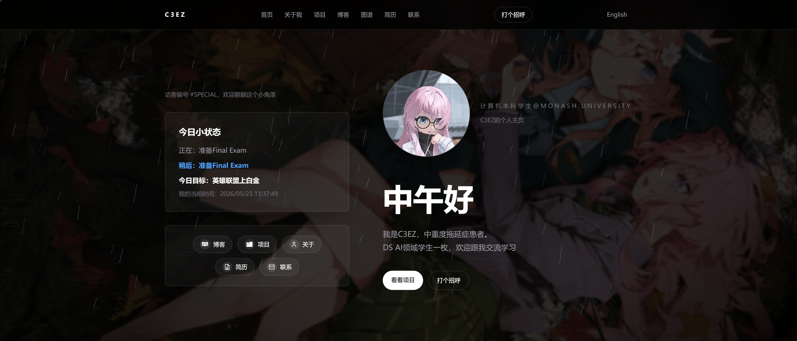

# Atlas

[中文](./README.md) | English

Atlas is a dark Astro personal website template for students, makers, and design-engineering learners. It is built for course notes, small projects, writing, resume-style experience, and personal links.

The template uses Astro Content Collections for blog posts and projects, so most content is typed, file-based, and easy to replace.

## ✨ Demo

[](https://astro.build/)
[](https://tailwindcss.com/)


🌐 Live preview: [https://blog.chihaya-anon.uk/](https://blog.chihaya-anon.uk/)

🌧️ Configurable background, rain animation, bilingual navigation, status card, and personal quick links all come together in this demo.



## Features

- Dark visual style with a student-friendly personal homepage
- Avatar, status card, quick links, project cards, notes, resume, and contact pages
- Built-in Chinese and English routes: Chinese by default, English under `/en/`
- Blog posts written in Markdown
- Project case studies written in Markdown
- Central site copy and navigation in `src/config/site.ts`
- Astro Content Collections powered by `src/content.config.ts`
- Tailwind CSS v4 through `@tailwindcss/vite`
- Static output by default, with optional Node SSR mode for live server features

## 2025.05.28 Update

This update is a page modularisation refactor, converting fixed pages from hardcoded components into a configurable module system:

- Page modularisation: all built-in pages now render dynamically through `PageRenderer` using the `pages` config module arrays
- Added `src/modules/` directory with 14 reusable module components covering homepage, about, projects, blog, graph, resume, and contact pages
- Module type definitions centralised in `src/modules/types.ts`; adding a new module only requires a component and a type entry
- Custom page support: define `customPages` in the site config to generate new pages without creating Astro route files
- Removed redundant config fields: page-level `kicker`/`heading`/`intro` (now maintained in module props), deprecated `home.services`/`home.projects`/`home.notes`, and `downloadResumeLabel`
- Unified localisation with `localizeModuleLinks` for automatic multi-language link handling in modules, replacing the old page-level `services.map` approach
- Added dynamic server mode: interactive setup script (`npm run setup`) to choose static or Node SSR mode, enabling live Steam status and visitor count
- Added Steam status API with homepage badge showing real-time online status and current game
- Added Steam profile card component, configurable via `steamProfile` module on about page with game records
- Added `gameList` module for custom item lists on about page (games, focus areas, etc.) with icon and link support
- Fixed homepage greeting and Steam status refresh after language switches
- Added PM2 production mode support (`npm run pm2:start`)
- Updated example `site.ts` to show the complete modular configuration

## 2025.05.23 Update

This update focused on feature and structure improvements without changing personal content:

- Added configurable background system: background image, blur, opacity, scale, overlay, and rain animation controls
- Rain animation supports two modes: `falling` for top-to-bottom rain and `front` for screen-facing rain with ripples
- Decoupled homepage services and about page services, now using `home.services` and `pages.about.services`
- Resume page now supports PDF download via `resume.files` with configurable multiple files stored in `public/`
- Resume project entries now support a `link` field for multiple action buttons with custom labels
- Resume data restructured into `summary`, `details`, `links`, `highlights`, and `sections`
- Removed unused legacy fields such as `experience`, `location`, and `locationLabel`
- Added icon component; social links, quick links, and email icons now support image URLs
- Added knowledge graph page and wiki link support for blog interlinking
- Blog dynamic routes now support multi-level paths for organising Markdown by course or topic
- Added dynamic development entry and PM2 production mode for server-side features

## Project Structure

```text
src/
  components/        Reusable UI components
  modules/           Reusable page module components
  config/            Site text, nav, social links, resume data
  content/           Blog and project Markdown content
  layouts/           Base layout and Markdown layout
  pages/             Route pages
  styles/            Global Tailwind styles
public/
  avatar.png         Default avatar placeholder
  favicon.svg        Site icon
```

## Getting Started

Install dependencies:

```sh
npm install
```

You can also use the interactive setup script to choose static mode or dynamic server mode:

```sh
npm run setup
```

Start the development server:

```sh
npm run dev
```

Build for production:

```sh
npm run build
```

Preview the production build:

```sh
npm run preview
```

## Customize

Most template text can be edited in:

```text
src/config/site.ts
```

Use this file to update:

- Site name and description
- Chinese and English site copy
- Navigation
- Avatar path
- Social links
- Homepage hero text
- Status card
- Quick links
- About, projects, blog, resume, and contact page copy
- Skills and experience
- Shared UI labels

### Page Modules

Built-in pages are now generated from the `pages` config in `src/config/site.ts`. Each page has `title`, `description`, and `modules`; the rendered order follows the `modules` array:

```ts
pages: {
  about: {
    title: 'About',
    description: 'About this site owner',
    modules: [
      {
        type: 'aboutIntro',
        props: {
          kicker: 'About',
          heading: 'About me',
          profileLabel: 'Profile',
          profile: 'Student / developer',
          paragraphs: ['Write your intro here.'],
        },
      },
      { type: 'steamProfile' },
      {
        type: 'gameList',
        props: {
          title: 'Recently playing',
          description: 'Come play with me',
          items: [
            { label: 'Game Name', gameId: 123, icon: '/game/icon.png', href: 'https://example.com' },
          ],
        },
      },
      { type: 'contactPanel' },
    ],
  },
}
```

Available module schemas live in `src/modules/types.ts`. Built-in module types include:

- `homeHero`: homepage hero, status card, and Steam badge
- `linkGrid`: homepage quick links
- `projectGrid` / `projectList`: project lists
- `blogPreview` / `blogIndex`: blog preview and blog index
- `aboutIntro`: about page intro
- `steamProfile`: Steam profile card
- `gameList`: custom game/item list with optional `icon`, `href`, and `gameId`
- `skillCloud`: skill tags
- `knowledgeGraph`: knowledge graph
- `resume`: resume page body
- `contactCards`: contact cards
- `contactPanel`: bottom contact block
- `pageHeader`: generic page heading
- `richText`: simple text paragraphs

Blog detail pages and project detail pages still come from Markdown files in `src/content/`; the module system controls list pages, built-in pages, and custom pages.

### Custom Pages

Add `customPages` to the matching language config when you want a new page without creating a new Astro route:

```ts
customPages: [
  {
    path: '/uses',
    title: 'Uses',
    description: 'My daily tools and software',
    modules: [
      {
        type: 'pageHeader',
        props: {
          kicker: 'Uses',
          heading: 'My tools',
          intro: 'A list of tools I use often.',
        },
      },
      {
        type: 'richText',
        props: {
          body: ['First paragraph.', 'Second paragraph.'],
        },
      },
    ],
  },
]
```

Custom pages in the Chinese config are generated at `/uses/`; custom pages in the English config are generated at `/en/uses/`. The fixed page roots `about`, `blog`, `contact`, `graph`, `projects`, and `resume` cannot be overridden by `customPages`.

## Internationalization

Atlas uses Chinese as the default route and English under:

```text
/en/
/en/about/
/en/projects/
/en/blog/
/en/resume/
/en/contact/
```

Language copy lives in:

```text
src/config/site.ts
```

Use the `zh` config for Chinese and the `en` config for English. The Header includes an automatic language switcher.

Blog posts use one shared content set across all languages. Projects can use the `lang` frontmatter field for Chinese and English versions:

```md
---
lang: "zh"
title: "中文项目"
---
```

```md
---
lang: "en"
title: "English Project"
---
```

Replace the default avatar at:

```text
public/avatar.png
```

Replace the browser tab icon at:

```text
public/favicon.svg
```

Social icons can be configured in `src/config/site.ts`. The `icon` field supports short text or an image URL:

```ts
{ label: 'GitHub', href: 'https://github.com/yourname', icon: 'https://cdn.simpleicons.org/github/white' }
```

The email icon uses `emailIcon` in the same config file:

```ts
emailIcon: 'https://cdn.simpleicons.org/gmail/white'
```

Hero headings, page headings, descriptions, and the contact panel heading support manual line breaks with `\n`:

```ts
headline: 'First line\nSecond line'
```

## Content

Blog posts live in:

```text
src/content/blog/
```

Projects live in:

```text
src/content/projects/
```

Example blog post:

```md
---
title: "My First Note"
description: "A short description for the note."
pubDate: 2026-05-20
tags: ["Astro", "Study"]
draft: false
---

Write your note here.
```

Example project:

```md
---
lang: "en"
title: "Course Dashboard"
description: "A small dashboard made for a class project."
date: 2026-05-20
tags: ["Astro", "Tailwind"]
role: "Student Project"
featured: true
---

Write your project story here.
```

## Wiki Links And Knowledge Graph

Blog Markdown supports Obsidian-style wiki links:

```md
[[design-engineering]]
[[astro-content-collections|Astro Content Collections]]
```

During build, these are converted into internal blog links. Blog posts also show backlinks at the bottom when other notes mention them.

Wiki links are resolved by filename first, so you usually do not need to include the full folder path. For example, this file:

```text
src/content/blog/course-notes/week-02-expectation.md
```

can be linked as:

```md
[[week-02-expectation]]
```

If two files share the same name, use the full relative path:

```md
[[course-notes/week-02-expectation]]
```

The knowledge graph page lives at:

```text
/graph
```

The graph scans blog posts, tags, and wiki-link relationships. Post nodes can be clicked to open the related blog post.

## Deployment

Atlas builds to static files in `dist/`.

```sh
npm run build
```

Deploy the generated site with any static hosting platform. For Astro-specific deployment notes, see the [Astro deployment guide](https://docs.astro.build/en/guides/deploy/).

## Dynamic Mode

Atlas can still be built as a static site by default. If you want server-side features such as live Steam status, use dynamic server mode:

```sh
npm install
npm run build:dynamic
npm run start
```

Default URL:

```text
http://SERVER_IP:4321
```

Write Steam status and server binding configuration in `.env`:

```sh
STEAM_API_KEY=your Steam Web API key
STEAM_ID_64=your 64-bit Steam ID
HOST=0.0.0.0
PORT=4321
ATLAS_DATA_DIR=.atlas-data
```

Your Steam profile and game details must be public. Otherwise the site can only show offline or unavailable status. Dynamic visitor counts are stored in a local JSON file under `ATLAS_DATA_DIR`. Do not commit a real `.env`; this repo only includes `.env.example`. If `.env` and system environment variables define the same key, this project uses the `.env` value.

For long-running use, run it with PM2. `pm2:start` builds the dynamic server first, then starts the production server:

```sh
npm install
npm install -g pm2
npm run pm2:start
pm2 save
```

Useful commands:

```sh
npm run pm2:restart
npm run pm2:stop
npm run pm2:logs
npm run pm2:delete
```

Dynamic mode generates a Node SSR server instead of static-only files. It is useful for personal sites, private previews, or a VPS you control. For public access, put Nginx or Caddy with HTTPS in front of it.

If you only need the static site and do not use live Steam status, keep using:

```sh
npm install --omit=optional
npm run build
```

## License

This project is licensed under the [GNU General Public License v3.0](./LICENSE).
