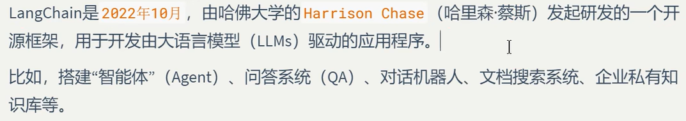
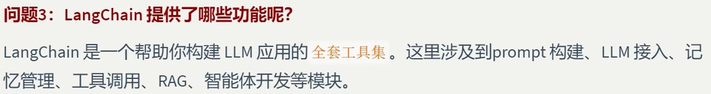

# 01. LangChain概览与环境

## 复习抓手

- LangChain：大模型应用开发框架，核心价值是组件化编排。
- LangGraph：适合构建更复杂的 Agent 状态流和多 Agent 协作。
- LangSmith：用于调试、追踪、评估大模型应用。
- LangServe：用于把链或应用服务化。
- 环境重点：Python 3.10+、虚拟环境、安装/卸载 LangChain。

---

## LangChain介绍







---

## LangChain架构设计


### LangChain


### LangGraph


可以实现Agent之间的交互

### LangSmith


### LangServe


---

## 开发环境搭建

1.创建虚拟环境并激活

```python
#python版本需要3.10以上版本
conda create -n your_env_name python=3.10 -y
#激活
conda activate your_env_name
```

2.安装langchain包

```python
#pip安装
pip install langchain
#conda安装
conda install -c conda-forge langchian
#卸载
pip uninstall langchain
conda uninstall langchain
```
