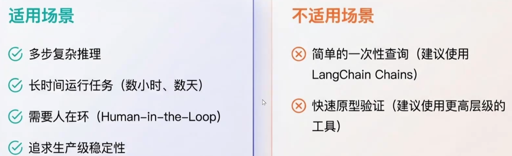

# 01. LangGraph概览与基础组件

## 复习抓手

- LangGraph 适合构建有状态、可恢复、可中断、可观测的 Agent 工作流。
- State 是图运行时的共享状态，所有节点都围绕 State 读取和更新。
- Node 是单一职责执行单元，可以是普通函数、大模型调用或工具调用。
- Edge 决定节点之间的流转方式，分为普通边和条件边。
- 最小学习目标：能定义 State、添加 Node、连接 Edge、compile graph 并 invoke/stream。

---

## 介绍

### 五大核心优势

1. **持久化执行**：保存状态和执行上下文。任何故障后皆可以无缝恢复，确保建造过程永不中断
2. **完整的内存管理**：融合短期工作记忆和长期持久记忆，为智能体赋予真正的上下文感知能力
3. **生产级可靠**：为项目提供工业级稳定性
4. **人在回路**：强大的中断机制，可以在关键节点介入、审核与引导，实现人机协同
5. **深度可观测行**：将复杂的执行路径可视化，让每一次建造都有迹可循



---

## 核心组件

### 人机交互


### 时光旅行


### 流式输出


### 工具调用


### 多智能体的设计

[Subgraph(主图)、协作模式](Subgraph(%E4%B8%BB%E5%9B%BE)%E3%80%81%E5%8D%8F%E4%BD%9C%E6%A8%A1%E5%BC%8F%20348937fc50ad80eebc16d322df1c5ace.md)

### 生产环境


---

## State、Nodes、Edges的定义

## State：图的记忆与血液

记录agent在运行过程中所有变量的数据与更新

所有数据通过State在节点间传递和更新

## Nodes

单一职责、纯函数优先、大模型或工具的调用

## Edges

负责连接从一个Node到另一个Nodes，分为普通边和条件边

---

## 节点与可控制性

## 节点与可控制性


langchain是线性的，langgraph是图，存在条件和循环分支

### 代码演示

#### 安装依赖包

```python
pip install -U langgraph
```

#### 定义State


```python
from langchain_core.messages import AnyMessage
from typing_extensions import TypedDict

#定义节点间的通讯的消息格式
class State(TypeDict):
	message:lsit[AnyMessage]
	extra_field:int
```

#### 定义Node

```python
from langchain_core.messages import AIMessage

def node(state:State):
	messages = state["message"]
	new_message = AIMessage("你好。我是节点1")

	return {
			"messages": messages + [new_message],
			"extra_field":1
	}
```

#### 创建graph


```python
from langgraph.graph import StateGraph

graph = StateGraph(State)
graph.add_node(node)
graph.set_entry_point("node1")#设置入口名node1
graph_builder = graph.compile()
```

#### 查看节点和图结构


```python
from IPython.display import Image,display

display(Image(graph_bulder.get_graph().draw_mermaid_png()))
```


#### 调用

```python
from langchain_core.messages import HumanMessage

result = graph_builder.invoke({
		"messages":[HumanMessage("你好，我是tom")]
})

for message in result["messages"]:
		message.pretty_print()
```


## 复习补充

LangGraph 的学习入口可以用一句话概括：把原本藏在 Agent 循环里的状态变化、分支判断和工具调用，显式拆成可观察、可恢复、可控制的图。和普通 Chain 相比，LangGraph 更适合流程不固定、需要循环、需要人工介入或需要长期运行的场景。

| 组件 | 可以怎么理解 | 复习重点 |
| --- | --- | --- |
| State | 图运行时的共享上下文 | 字段设计、合并策略、消息累积方式 |
| Node | 对 State 做一次读写的执行单元 | 单一职责、输入输出明确、尽量无副作用 |
| Edge | 决定下一个执行节点 | 普通边表达固定流程，条件边表达动态决策 |
| Graph | 节点和边组成的工作流 | compile 后可像 Runnable 一样调用 |
| Checkpoint | 图执行过程的快照 | 恢复、重放、分叉、人机交互都依赖它 |

### 易错点

- State 不是普通全局变量。节点应该返回“需要更新的字段”，而不是随意修改外部状态。
- Node 不一定必须调用模型。普通函数、工具包装、路由函数都可以是节点。
- Edge 不负责处理业务数据，只负责决定控制流。
- `START` 和 `END` 是图结构中的特殊节点，用来声明入口和结束。

### 复习检查清单

- 能否画出一个最小图：`START -> node -> END`。
- 能否解释一个节点为什么要返回字典。
- 能否说清 `StateGraph` 和普通函数调用的区别。
- 能否判断某个任务适合 Chain 还是 LangGraph。
