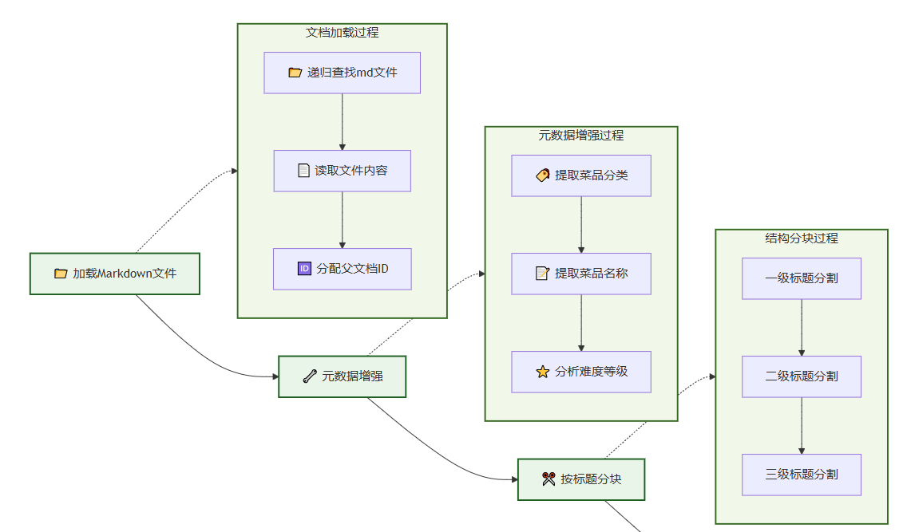

> 本文整理自 Mini RAG 课程的 C6 智能菜谱问答系统 RAG，保留原始代码和关键说明，并按博客合集顺序归档。

# 智能的食谱问答系统

# 总体架构

```python
Code/C2/
├── config.py                   # 配置管理
├── main.py                     # 主程序入口
├── requirements.txt            # 依赖列表
├── rag_modules/               # 核心模块
│   ├── __init__.py
│   ├── data_preparation.py    # 数据准备模块
│   ├── index_construction.py  # 索引构建模块
│   ├── retrieval_optimization.py # 检索优化模块
│   └── generation_integration.py # 生成集成模块
└── vector_index/              # 向量索引缓存（自动生成）
```

# 数据准备模块实现



**父子文本块映射关系**：

```
父文档（完整菜谱）
├── 子块1：菜品介绍 + 难度评级
├── 子块2：必备原料和工具
├── 子块3：计算（用量配比）
├── 子块4：操作（制作步骤）
└── 子块5：附加内容（变化做法）
```

**基本流程**：

- **检索阶段**：使用小的子块进行精确匹配，提高检索准确性
- **生成阶段**：传递完整的父文档给LLM，确保上下文完整性
- **智能去重**：当检索到同一道菜的多个子块时，合并为一个完整菜谱

**元数据增强**：

- **菜品分类**：从文件路径推断（荤菜、素菜、汤品等）
- **难度等级**：从内容中的星级标记提取
- **菜品名称**：从文件名提取
- **文档关系**：建立父子文档的ID映射关系

```python
文本块太小：
检索精确，但上下文不完整。

文本块太大：
上下文完整，但检索不精确。

父子文本块：
用小块负责检索，用大块负责生成。
```

## 模块类结构

代码中主要设计了一个 `DataPreparationModule`（数据准备模块类），它维护三个核心变量：

| 变量 | 作用 |
| --- | --- |
| `documents` | 保存完整父文档 |
| `chunks` | 保存切分后的子文档 |
| `parent_child_map` | 保存“子块 ID → 父文档 ID”的映射关系 |

**每个子块都能追溯回它所属的完整父文档**。后续检索系统只需要检索小块，找到相关小块后，再通过 `parent_id` 找回完整文档。

```python
class DataPreparationModule:
    """数据准备模块 - 负责数据加载、清洗和预处理"""
    # 统一维护的分类与难度配置，供外部复用，避免关键词重复定义
    CATEGORY_MAPPING = {
        'meat_dish': '荤菜',
        'vegetable_dish': '素菜',
        'soup': '汤品',
        'dessert': '甜品',
        'breakfast': '早餐',
        'staple': '主食',
        'aquatic': '水产',
        'condiment': '调料',
        'drink': '饮品'
    }
    CATEGORY_LABELS = list(set(CATEGORY_MAPPING.values()))
    DIFFICULTY_LABELS = ['非常简单', '简单', '中等', '困难', '非常困难']
    
    def __init__(self, data_path: str):
        """
        data_path: 数据文件夹路径
        """
        self.data_path = data_path
        self.documents: List[Document] = []  # 父文档（完整食谱）
        self.chunks: List[Document] = []     # 子文档（按标题分割的小块）
        self.parent_child_map: Dict[str, str] = {}  # 子块ID -> 父文档ID的映射
```

## **批量加载Markdown文件**

- 使用 `rglob("*.md")` 递归查找所有 Markdown 文件。
- 按 UTF-8 编码读取文件内容，保留原始 Markdown 格式。
- 为每个父文档创建一个 `Document`（文档对象），其中包含正文内容和元数据。

```python
def load_documents(self) -> List[Document]:
        logger.info(f"正在从 {self.data_path} 加载文档...")
        # 直接读取Markdown文件以保持原始格式
        documents = []
        data_path_obj = Path(self.data_path)

        for md_file in data_path_obj.rglob("*.md"):
            try:
                # 直接读取文件内容，保持Markdown格式
                with open(md_file, 'r', encoding='utf-8') as f:
                    content = f.read()

                # 为每个父文档分配确定性的唯一ID（基于数据根目录的相对路径）
                try:
                    data_root = Path(self.data_path).resolve()
                    relative_path = Path(md_file).resolve().relative_to(data_root).as_posix()
                except Exception:
                    relative_path = Path(md_file).as_posix()
                parent_id = hashlib.md5(relative_path.encode("utf-8")).hexdigest()

                # 创建Document对象
                doc = Document(
                    page_content=content,
                    metadata={
                        "source": str(md_file),
                        "parent_id": parent_id,
                        "doc_type": "parent"  # 标记为父文档
                    }
                )
                documents.append(doc)

            except Exception as e:
                logger.warning(f"读取文件 {md_file} 失败: {e}")
        
        # 增强文档元数据
        for doc in documents:
            self._enhance_metadata(doc)
        
        self.documents = documents
        logger.info(f"成功加载 {len(documents)} 个文档")
        return documents
```

## **元数据增强**

元数据增强主要是为了让后续检索更准确。它提取了三类信息：

| 元数据 | 来源 | 作用 |
| --- | --- | --- |
| 菜品分类 | 文件路径 | 用于按类别过滤，例如荤菜、素菜、汤品 |
| 菜品名称 | 文件名 | 用于标识具体菜品 |
| 难度等级 | 文档中的星级符号 | 用于难度筛选 |

```python
def _enhance_metadata(self, doc: Document):
        file_path = Path(doc.metadata.get('source', ''))
        path_parts = file_path.parts
        
        # 提取菜品分类
        doc.metadata['category'] = '其他'
        for key, value in self.CATEGORY_MAPPING.items():
            if key in path_parts:
                doc.metadata['category'] = value
                break
        
        # 提取菜品名称
        doc.metadata['dish_name'] = file_path.stem

        # 分析难度等级
        content = doc.page_content
        if '★★★★★' in content:
            doc.metadata['difficulty'] = '非常困难'
        elif '★★★★' in content:
            doc.metadata['difficulty'] = '困难'
        elif '★★★' in content:
            doc.metadata['difficulty'] = '中等'
        elif '★★' in content:
            doc.metadata['difficulty'] = '简单'
        elif '★' in content:
            doc.metadata['difficulty'] = '非常简单'
        else:
            doc.metadata['difficulty'] = '未知'
```

## Markdown 结构化分块

分块不是简单按照固定字数切，而是按照 Markdown 标题结构切：

```
# 一级标题
## 二级标题
### 三级标题
```

```python
def chunk_documents(self) -> List[Document]:
        logger.info("正在进行Markdown结构感知分块...")

        if not self.documents:
            raise ValueError("请先加载文档")

        # 使用Markdown标题分割器
        chunks = self._markdown_header_split()

        # 为每个chunk添加基础元数据
        for i, chunk in enumerate(chunks):
            if 'chunk_id' not in chunk.metadata:
                # 如果没有chunk_id（比如分割失败的情况），则生成一个
                chunk.metadata['chunk_id'] = str(uuid.uuid4())
            chunk.metadata['batch_index'] = i  # 在当前批次中的索引
            chunk.metadata['chunk_size'] = len(chunk.page_content)

        self.chunks = chunks
        logger.info(f"Markdown分块完成，共生成 {len(chunks)} 个chunk")
        return chunks

    def _markdown_header_split(self) -> List[Document]:
        # 定义要分割的标题层级
        headers_to_split_on = [
            ("#", "主标题"),      # 菜品名称
            ("##", "二级标题"),   # 必备原料、计算、操作等
            ("###", "三级标题")   # 简易版本、复杂版本等
        ]

        # 创建Markdown分割器
        markdown_splitter = MarkdownHeaderTextSplitter(
            headers_to_split_on=headers_to_split_on,
            strip_headers=False  # 保留标题，便于理解上下文
        )

        all_chunks = []

        for doc in self.documents:
            try:
                # 检查文档内容是否包含Markdown标题
                content_preview = doc.page_content[:200]
                has_headers = any(line.strip().startswith('#') for line in content_preview.split('\n'))

                if not has_headers:
                    logger.warning(f"文档 {doc.metadata.get('dish_name', '未知')} 内容中没有发现Markdown标题")
                    logger.debug(f"内容预览: {content_preview}")

                # 对每个文档进行Markdown分割
                md_chunks = markdown_splitter.split_text(doc.page_content)

                logger.debug(f"文档 {doc.metadata.get('dish_name', '未知')} 分割成 {len(md_chunks)} 个chunk")

                # 如果没有分割成功，说明文档可能没有标题结构
                if len(md_chunks) <= 1:
                    logger.warning(f"文档 {doc.metadata.get('dish_name', '未知')} 未能按标题分割，可能缺少标题结构")

                # 为每个子块建立与父文档的关系
                parent_id = doc.metadata["parent_id"]

                for i, chunk in enumerate(md_chunks):
                    # 为子块分配唯一ID
                    child_id = str(uuid.uuid4())

                    # 合并原文档元数据和新的标题元数据
                    chunk.metadata.update(doc.metadata)
                    chunk.metadata.update({
                        "chunk_id": child_id,
                        "parent_id": parent_id,
                        "doc_type": "child",  # 标记为子文档
                        "chunk_index": i      # 在父文档中的位置
                    })

                    # 建立父子映射关系
                    self.parent_child_map[child_id] = parent_id

                all_chunks.extend(md_chunks)

            except Exception as e:
                logger.warning(f"文档 {doc.metadata.get('source', '未知')} Markdown分割失败: {e}")
                # 如果Markdown分割失败，将整个文档作为一个chunk
                all_chunks.append(doc)

        logger.info(f"Markdown结构分割完成，生成 {len(all_chunks)} 个结构化块")
        return all_chunks
```

## 智能去重

智能去重解决的是一个常见问题：用户问“宫保鸡丁怎么做”时，系统可能同时检索到“宫保鸡丁”的原料子块、步骤子块、附加内容子块。如果不去重，最终可能重复返回同一道菜的多个片段。

```python
统计每个父文档被命中的子块数量
        ↓
按照命中数量排序
        ↓
每个父文档只保留一次
        ↓
返回完整父文档
```

```python
def get_parent_documents(self, child_chunks: List[Document]) -> List[Document]:
        # 统计每个父文档被匹配的次数（相关性指标）
        parent_relevance = {}
        parent_docs_map = {}

        # 收集所有相关的父文档ID和相关性分数
        for chunk in child_chunks:
            parent_id = chunk.metadata.get("parent_id")
            if parent_id:
                # 增加相关性计数
                parent_relevance[parent_id] = parent_relevance.get(parent_id, 0) + 1

                # 缓存父文档（避免重复查找）
                if parent_id not in parent_docs_map:
                    for doc in self.documents:
                        if doc.metadata.get("parent_id") == parent_id:
                            parent_docs_map[parent_id] = doc
                            break

        # 按相关性排序（匹配次数多的排在前面）
        sorted_parent_ids = sorted(parent_relevance.keys(),
                                 key=lambda x: parent_relevance[x],
                                 reverse=True)

        # 构建去重后的父文档列表
        parent_docs = []
        for parent_id in sorted_parent_ids:
            if parent_id in parent_docs_map:
                parent_docs.append(parent_docs_map[parent_id])

        # 收集父文档名称和相关性信息用于日志
        parent_info = []
        for doc in parent_docs:
            dish_name = doc.metadata.get('dish_name', '未知菜品')
            parent_id = doc.metadata.get('parent_id')
            relevance_count = parent_relevance.get(parent_id, 0)
            parent_info.append(f"{dish_name}({relevance_count}块)")

        logger.info(f"从 {len(child_chunks)} 个子块中找到 {len(parent_docs)} 个去重父文档: {', '.join(parent_info)}")
        return parent_docs
```

## 对外支持难度和分类标签列表

```python
@classmethod
def get_supported_categories(cls) -> List[str]:
    """对外提供支持的分类标签列表"""
    return cls.CATEGORY_LABELS

@classmethod
def get_supported_difficulties(cls) -> List[str]:
    """对外提供支持的难度标签列表"""
    return cls.DIFFICULTY_LABELS
```

# **索引构建**


```python
初始化嵌入模型
    ↓
将文本块转换成向量
    ↓
构建并保存 FAISS 索引
```

| 检索方式 | 作用 | 优点 |
| --- | --- | --- |
| 向量检索 | 根据语义相似度查找 | 能理解“做法”“制作步骤”“烹饪流程”等近义表达 |
| BM25（关键词检索算法） | 根据关键词匹配查找 | 能精确匹配菜名、食材、烹饪方式 |
| RRF（倒数排名融合） | 融合两路结果 | 避免只依赖单一检索方式 |

## 模块类结构设计

```python
class IndexConstructionModule:

    def __init__(self, model_name: str = "BAAI/bge-small-zh-v1.5", index_save_path: str = "./vector_index"):
        """
        model_name: 嵌入模型名称
        index_save_path: 索引保存路径
        """
        self.model_name = model_name
        self.index_save_path = index_save_path
        self.embeddings = None
        self.vectorstore = None
        self.setup_embeddings()
```

## **嵌入模型初始化**

```python
def setup_embeddings(self):
        logger.info(f"正在初始化嵌入模型: {self.model_name}")
        
        self.embeddings = HuggingFaceEmbeddings(
            model_name=self.model_name,
            model_kwargs={'device': 'cpu'},
            encode_kwargs={'normalize_embeddings': True}
        )
        
        logger.info("嵌入模型初始化完成")
```

## **向量索引构建**

```python
文本块：西红柿炒鸡蛋的原料部分
    ↓
嵌入模型：转换成一个高维向量
    ↓
FAISS：把这个向量存入索引
    ↓
用户查询时：计算查询向量，与已有向量做相似度匹配
```

```python
def build_vector_index(self, chunks: List[Document]) -> FAISS:
        logger.info("正在构建FAISS向量索引...")
        
        if not chunks:
            raise ValueError("文档块列表不能为空")
        
        # 构建FAISS向量存储
        self.vectorstore = FAISS.from_documents(
            documents=chunks,
            embedding=self.embeddings
        )
        
        logger.info(f"向量索引构建完成，包含 {len(chunks)} 个向量")
        return self.vectorstore
```

## **索引缓存机制**

第一次运行时，系统需要把所有文本块都送入嵌入模型计算向量，再构建 FAISS 索引，这个过程比较慢。为了避免每次启动都重新构建索引,`save_index()` 会把 FAISS 索引保存到本地，`load_index()` 会在下次运行时直接加载已有索引。

```python
def add_documents(self, new_chunks: List[Document]):
        if not self.vectorstore:
            raise ValueError("请先构建向量索引")
        
        logger.info(f"正在添加 {len(new_chunks)} 个新文档到索引...")
        self.vectorstore.add_documents(new_chunks)
        logger.info("新文档添加完成")

def save_index(self):
    if not self.vectorstore:
        raise ValueError("请先构建向量索引")

    # 确保保存目录存在
    Path(self.index_save_path).mkdir(parents=True, exist_ok=True)

    self.vectorstore.save_local(self.index_save_path)
    logger.info(f"向量索引已保存到: {self.index_save_path}")

def load_index(self):
    if not self.embeddings:
        self.setup_embeddings()

    if not Path(self.index_save_path).exists():
        logger.info(f"索引路径不存在: {self.index_save_path}，将构建新索引")
        return None

    try:
        self.vectorstore = FAISS.load_local(
            self.index_save_path,
            self.embeddings,
            allow_dangerous_deserialization=True
        )
        logger.info(f"向量索引已从 {self.index_save_path} 加载")
        return self.vectorstore
    except Exception as e:
        logger.warning(f"加载向量索引失败: {e}，将构建新索引")
        return None
```

- **FAISS 负责向量索引**：把文本块变成向量并存储，方便语义检索。
- **BGE 负责文本向量化**：把中文文本转换成语义向量。

# 检索优化模块

```python
用户查询 query
    ↓
向量检索返回一组结果
    ↓
BM25 返回一组结果
    ↓
RRF 根据排名重新打分
    ↓
元数据过滤
```

## 模块类结构设计

```python
class RetrievalOptimizationModule:
    
    def __init__(self, vectorstore: FAISS, chunks: List[Document]):
        self.vectorstore = vectorstore #FAISS向量存储
        self.chunks = chunks #文档块列表
        self.setup_retrievers()
```

## 检索器设置

```python
"""设置向量检索器和BM25检索器"""
def setup_retrievers(self):
    logger.info("正在设置检索器...")

    # 向量检索器
    self.vector_retriever = self.vectorstore.as_retriever(
        search_type="similarity",
        search_kwargs={"k": 5}
    )

    # BM25检索器
    self.bm25_retriever = BM25Retriever.from_documents(
        self.chunks,
        k=5
    )
```

## **RRF混合检索**

**向量检索的优势**：

- 理解语义相似性，如"简单易做的菜"能匹配到标记为"简单"的菜谱
- 处理同义词和近义词，如"制作方法"和"做法"、"烹饪步骤"
- 理解用户意图，如"适合新手"能找到难度较低的菜谱

**BM25检索的优势**：

- 精确匹配菜名，如"宫保鸡丁"能准确找到对应菜谱
- 匹配具体食材，如"土豆丝"、"西红柿"等关键词
- 处理专业术语，如"爆炒"、"红烧"等烹饪手法

```python
"""
混合检索 - 结合向量检索和BM25检索，使用RRF重排
Args:
    query: 查询文本
    top_k: 返回结果数量
Returns:
    检索到的文档列表
"""
def hybrid_search(self, query: str, top_k: int = 3) -> List[Document]: 
    # 分别获取向量检索和BM25检索结果
    vector_docs = self.vector_retriever.invoke(query)
    bm25_docs = self.bm25_retriever.invoke(query)

    # 使用RRF重排
    reranked_docs = self._rrf_rerank(vector_docs, bm25_docs)
    return reranked_docs[:top_k]

def _rrf_rerank(self, vector_docs: List[Document], bm25_docs: List[Document], k: int = 60) -> List[Document]:
    """
    使用RRF (Reciprocal Rank Fusion) 算法重排文档

    Args:
        vector_docs: 向量检索结果
        bm25_docs: BM25检索结果
        k: RRF参数，用于平滑排名

    Returns:
        重排后的文档列表
    """
    doc_scores = {}
    doc_objects = {}

    # 计算向量检索结果的RRF分数
    for rank, doc in enumerate(vector_docs):
        # 使用文档内容的确定性哈希作为唯一标识
        doc_id = hashlib.md5(doc.page_content.encode('utf-8')).hexdigest()
        doc_objects[doc_id] = doc

        # RRF公式: 1 / (k + rank)
        rrf_score = 1.0 / (k + rank + 1)
        doc_scores[doc_id] = doc_scores.get(doc_id, 0) + rrf_score

        logger.debug(f"向量检索 - 文档{rank+1}: RRF分数 = {rrf_score:.4f}")

    # 计算BM25检索结果的RRF分数
    for rank, doc in enumerate(bm25_docs):
        doc_id = hashlib.md5(doc.page_content.encode('utf-8')).hexdigest()
        doc_objects[doc_id] = doc

        rrf_score = 1.0 / (k + rank + 1)
        doc_scores[doc_id] = doc_scores.get(doc_id, 0) + rrf_score

        logger.debug(f"BM25检索 - 文档{rank+1}: RRF分数 = {rrf_score:.4f}")

    # 按最终RRF分数排序
    sorted_docs = sorted(doc_scores.items(), key=lambda x: x[1], reverse=True)

    # 构建最终结果
    reranked_docs = []
    for doc_id, final_score in sorted_docs:
        if doc_id in doc_objects:
            doc = doc_objects[doc_id]
            # 将RRF分数添加到文档元数据中
            doc.metadata['rrf_score'] = final_score
            reranked_docs.append(doc)
            logger.debug(f"最终排序 - 文档: {doc.page_content[:50]}... 最终RRF分数: {final_score:.4f}")

    logger.info(f"RRF重排完成: 向量检索{len(vector_docs)}个文档, BM25检索{len(bm25_docs)}个文档, 合并后{len(reranked_docs)}个文档")

    return reranked_docs
```

## 元数据过滤**检索**

**过滤检索应用场景**：

- 用户询问"推荐几道素菜"时，可以按菜品分类过滤，只检索素菜相关的内容
- 新手用户问"有什么简单的菜谱"时，可以按难度等级过滤，只返回标记为"简单"的菜谱
- 想做汤品时询问"今天喝什么汤"，可以按分类过滤出所有汤品菜谱

```python
def metadata_filtered_search(self, query: str, filters: Dict[str, Any], top_k: int = 5) -> List[Document]:
    # 先进行混合检索，获取更多候选
    docs = self.hybrid_search(query, top_k * 3)
    
    # 应用元数据过滤
    filtered_docs = []
    for doc in docs:
        match = True
        for key, value in filters.items():
            if key in doc.metadata:
                if isinstance(value, list):
                    if doc.metadata[key] not in value:
                        match = False
                        break
                else:
                    if doc.metadata[key] != value:
                        match = False
                        break
            else:
                match = False
                break
        
        if match:
            filtered_docs.append(doc)
            if len(filtered_docs) >= top_k:
                break
    
    return filtered_docs
```

- **BM25 弥补向量检索不足**：适合精确匹配菜名、食材、关键词。
- **RRF 负责融合排序**：把向量检索和 BM25 检索结果合并，提高召回质量。
- **元数据过滤负责精确控制范围**：可以按分类、难度等字段筛选结果。

# **生成集成**


**智能查询路由**：根据用户查询自动判断是列表查询、详细查询还是一般查询，选择最适合的生成策略。

**查询重写优化**：对模糊不清的查询进行智能重写，提升检索效果。比如将"做菜"重写为"简单易做的家常菜谱"。

**多模式生成**：

- **列表模式**：适用于推荐类查询，返回简洁的菜品列表
- **详细模式**：适用于制作类查询，提供分步骤的详细指导
- **基础模式**：适用于一般性问题，提供常规回答

```python
用户输入问题
    ↓
查询路由
    ↓
查询重写
    ↓
混合检索
    ↓
获取父文档
    ↓
根据问题类型选择生成模式
    ↓
输出最终答案
```

## 模块类结构设计

```python
class GenerationIntegrationModule:
    """生成集成模块 - 负责LLM集成和回答生成"""
    
    def __init__(self, model_name: str = "kimi-k2-0711-preview", temperature: float = 0.1, max_tokens: int = 2048):
        """
        初始化生成集成模块        
        Args:
            model_name: 模型名称
            temperature: 生成温度
            max_tokens: 最大token数
        """
        self.model_name = model_name
        self.temperature = temperature
        self.max_tokens = max_tokens
        self.llm = None
        self.setup_llm()
```

## 初始化大预言模型

```python
def setup_llm(self):
     
    logger.info(f"正在初始化LLM: {self.model_name}")

    api_key = os.getenv("MOONSHOT_API_KEY")
    if not api_key:
        raise ValueError("请设置 MOONSHOT_API_KEY 环境变量")

    self.llm = MoonshotChat(
        model=self.model_name,
        temperature=self.temperature,
        max_tokens=self.max_tokens,
        moonshot_api_key=api_key
    )
    
    logger.info("LLM初始化完成")
```

## **查询路由实现**

当用户的问题比较模糊时，系统会让 LLM 重新组织查询，使其更适合检索。

```python
def query_router(self, query: str) -> str:
    prompt = ChatPromptTemplate.from_template("""
				根据用户的问题，将其分类为以下三种类型之一：
				1. 'list' - 用户想要获取菜品列表或推荐，只需要菜名
				例如：推荐几个素菜、有什么川菜、给我3个简单的菜
				2. 'detail' - 用户想要具体的制作方法或详细信息
				例如：宫保鸡丁怎么做、制作步骤、需要什么食材
				3. 'general' - 其他一般性问题
				例如：什么是川菜、制作技巧、营养价值
				请只返回分类结果：list、detail 或 general
				用户问题: {query}
				分类结果:"""
		)

    chain = (
        {"query": RunnablePassthrough()}
        | prompt
        | self.llm
        | StrOutputParser()
    )

    result = chain.invoke(query).strip().lower()

    # 确保返回有效的路由类型
    if result in ['list', 'detail', 'general']:
        return result
    else:
        return 'general'  # 默认类型
```

## **查询重写优化**

```python
 def query_rewrite(self, query: str) -> str:
        prompt = PromptTemplate(
            template="""
								你是一个智能查询分析助手。请分析用户的查询，判断是否需要重写以提高食谱搜索效果。
								
								原始查询: {query}
								
								分析规则：
								1. **具体明确的查询**（直接返回原查询）：
								   - 包含具体菜品名称：如"宫保鸡丁怎么做"、"红烧肉的制作方法"
								   - 明确的制作询问：如"蛋炒饭需要什么食材"、"糖醋排骨的步骤"
								   - 具体的烹饪技巧：如"如何炒菜不粘锅"、"怎样调制糖醋汁"
								
								2. **模糊不清的查询**（需要重写）：
								   - 过于宽泛：如"做菜"、"有什么好吃的"、"推荐个菜"
								   - 缺乏具体信息：如"川菜"、"素菜"、"简单的"
								   - 口语化表达：如"想吃点什么"、"有饮品推荐吗"
								
								重写原则：
								- 保持原意不变
								- 增加相关烹饪术语
								- 优先推荐简单易做的
								- 保持简洁性
								
								示例：
								- "做菜" → "简单易做的家常菜谱"
								- "有饮品推荐吗" → "简单饮品制作方法"
								- "推荐个菜" → "简单家常菜推荐"
								- "川菜" → "经典川菜菜谱"
								- "宫保鸡丁怎么做" → "宫保鸡丁怎么做"（保持原查询）
								- "红烧肉需要什么食材" → "红烧肉需要什么食材"（保持原查询）
								
								请输出最终查询（如果不需要重写就返回原查询）:""",
            input_variables=["query"]
        )

        chain = (
            {"query": RunnablePassthrough()}
            | prompt
            | self.llm
            | StrOutputParser()
        )

        response = chain.invoke(query).strip()

        # 记录重写结果
        if response != query:
            logger.info(f"查询已重写: '{query}' → '{response}'")
        else:
            logger.info(f"查询无需重写: '{query}'")

        return response

```

## **多模式生成**

```python
def generate_list_answer(self, query: str, context_docs: List[Document]) -> str:
    if not context_docs:
        return "抱歉，没有找到相关的菜品信息。"

    # 提取菜品名称
    dish_names = []
    for doc in context_docs:
        dish_name = doc.metadata.get('dish_name', '未知菜品')
        if dish_name not in dish_names:
            dish_names.append(dish_name)

    # 构建简洁的列表回答
    if len(dish_names) == 1:
        return f"为您推荐：{dish_names[0]}"
    elif len(dish_names) <= 3:
        return f"为您推荐以下菜品：\n" + "\n".join([f"{i+1}. {name}" for i, name in enumerate(dish_names)])
    else:
        return f"为您推荐以下菜品：\n" + "\n".join([f"{i+1}. {name}" for i, name in enumerate(dish_names[:3])]) + f"\n\n还有其他 {len(dish_names)-3} 道菜品可供选择。"

def generate_basic_answer_stream(self, query: str, context_docs: List[Document]):
    context = self._build_context(context_docs)

    prompt = ChatPromptTemplate.from_template("""
				你是一位专业的烹饪助手。请根据以下食谱信息回答用户的问题。
				
				用户问题: {question}
				
				相关食谱信息:
				{context}
				
				请提供详细、实用的回答。如果信息不足，请诚实说明。
				
				回答:""")

    chain = (
        {"question": RunnablePassthrough(), "context": lambda _: context}
        | prompt
        | self.llm
        | StrOutputParser()
    )

    for chunk in chain.stream(query):
        yield chunk

def generate_step_by_step_answer_stream(self, query: str, context_docs: List[Document]):
    
    context = self._build_context(context_docs)

    prompt = ChatPromptTemplate.from_template("""
				你是一位专业的烹饪导师。请根据食谱信息，为用户提供详细的分步骤指导。
				
				用户问题: {question}
				
				相关食谱信息:
				{context}
				
				请灵活组织回答，建议包含以下部分（可根据实际内容调整）：
				
				## 🥘 菜品介绍
				[简要介绍菜品特点和难度]
				
				## 🛒 所需食材
				[列出主要食材和用量]
				
				## 👨‍🍳 制作步骤
				[详细的分步骤说明，每步包含具体操作和大概所需时间]
				
				## 💡 制作技巧
				[仅在有实用技巧时包含。如果原文的"附加内容"与烹饪无关或为空，可以基于制作步骤总结关键要点，或者完全省略此部分]
				
				注意：
				- 根据实际内容灵活调整结构
				- 不要强行填充无关内容
				- 重点突出实用性和可操作性
				
				回答:""")

    chain = (
        {"question": RunnablePassthrough(), "context": lambda _: context}
        | prompt
        | self.llm
        | StrOutputParser()
    )

    for chunk in chain.stream(query):
        yield chunk
 
 def _build_context(self, docs: List[Document], max_length: int = 2000) -> str:
        """
        构建上下文字符串
        
        Args:
            docs: 文档列表
            max_length: 最大长度    
        Returns:
            格式化的上下文字符串
        """
        if not docs:
            return "暂无相关食谱信息。"
        
        context_parts = []
        current_length = 0
        
        for i, doc in enumerate(docs, 1):
            # 添加元数据信息
            metadata_info = f"【食谱 {i}】"
            if 'dish_name' in doc.metadata:
                metadata_info += f" {doc.metadata['dish_name']}"
            if 'category' in doc.metadata:
                metadata_info += f" | 分类: {doc.metadata['category']}"
            if 'difficulty' in doc.metadata:
                metadata_info += f" | 难度: {doc.metadata['difficulty']}"
            
            # 构建文档文本
            doc_text = f"{metadata_info}\n{doc.page_content}\n"
            
            # 检查长度限制
            if current_length + len(doc_text) > max_length:
                break
            
            context_parts.append(doc_text)
            current_length += len(doc_text)
        divider = "\n" + "="*50 + "\n"
        return divider + divider.join(context_parts)
```

# 配置文件

```python
"""
RAG系统配置文件
"""

from dataclasses import dataclass
from typing import Dict, Any

@dataclass
class RAGConfig:
    """RAG系统配置类"""

    # 路径配置
    data_path: str = ""
    index_save_path: str = "./vector_index"

    # 模型配置
    embedding_model: str = ""
    llm_model: str = ""

    # 检索配置
    top_k: int = 3

    # 生成配置
    temperature: float = 0.7
    max_tokens: int = 50000

    def __post_init__(self):
        """初始化后的处理"""
        pass
    
    @classmethod
    def from_dict(cls, config_dict: Dict[str, Any]) -> 'RAGConfig':
        """从字典创建配置对象"""
        return cls(**config_dict)
    
    def to_dict(self) -> Dict[str, Any]:
        """转换为字典"""
        return {
            'data_path': self.data_path,
            'index_save_path': self.index_save_path,
            'embedding_model': self.embedding_model,
            'llm_model': self.llm_model,
            'top_k': self.top_k,
            'temperature': self.temperature,
            'max_tokens': self.max_tokens
        }

# 默认配置实例
DEFAULT_CONFIG = RAGConfig()
```

# 系统整合

## 模块类结构设计

```python
class RecipeRAGSystem:
    """食谱RAG系统主类"""

    def __init__(self, config: RAGConfig = None):
        """
        初始化RAG系统
        Args:
            config: RAG系统配置，默认使用DEFAULT_CONFIG
        """
        self.config = config or DEFAULT_CONFIG
        self.data_module = None
        self.index_module = None
        self.retrieval_module = None
        self.generation_module = None

        # 检查数据路径
        if not Path(self.config.data_path).exists():
            raise FileNotFoundError(f"数据路径不存在: {self.config.data_path}")

        # 检查API密钥
        if not os.getenv("MOONSHOT_API_KEY"):
            raise ValueError("请设置 MOONSHOT_API_KEY 环境变量")
```

## 初始化所有模块

```python
def initialize_system(self):
    """初始化所有模块"""
    print("🚀 正在初始化RAG系统...")

    # 1. 初始化数据准备模块
    print("初始化数据准备模块...")
    self.data_module = DataPreparationModule(self.config.data_path)

    # 2. 初始化索引构建模块
    print("初始化索引构建模块...")
    self.index_module = IndexConstructionModule(
        model_name=self.config.embedding_model,
        index_save_path=self.config.index_save_path
    )

    # 3. 初始化生成集成模块
    print("🤖 初始化生成集成模块...")
    self.generation_module = GenerationIntegrationModule(
        model_name=self.config.llm_model,
        temperature=self.config.temperature,
        max_tokens=self.config.max_tokens
    )

    print("✅ 系统初始化完成！")
```

## 构建知识库

```python
def build_knowledge_base(self):
    print("\n正在构建知识库...")

    # 1. 尝试加载已保存的索引
    vectorstore = self.index_module.load_index()

    if vectorstore is not None:
        print("✅ 成功加载已保存的向量索引！")
        # 仍需要加载文档和分块用于检索模块
        print("加载食谱文档...")
        self.data_module.load_documents()
        print("进行文本分块...")
        chunks = self.data_module.chunk_documents()
    else:
        print("未找到已保存的索引，开始构建新索引...")

        # 2. 加载文档
        print("加载食谱文档...")
        self.data_module.load_documents()

        # 3. 文本分块
        print("进行文本分块...")
        chunks = self.data_module.chunk_documents()

        # 4. 构建向量索引
        print("构建向量索引...")
        vectorstore = self.index_module.build_vector_index(chunks)

        # 5. 保存索引
        print("保存向量索引...")
        self.index_module.save_index()

    # 6. 初始化检索优化模块
    print("初始化检索优化...")
    self.retrieval_module = RetrievalOptimizationModule(vectorstore, chunks)

    # 7. 显示统计信息
    stats = self.data_module.get_statistics()
    print(f"\n📊 知识库统计:")
    print(f"   文档总数: {stats['total_documents']}")
    print(f"   文本块数: {stats['total_chunks']}")
    print(f"   菜品分类: {list(stats['categories'].keys())}")
    print(f"   难度分布: {stats['difficulties']}")

    print("✅ 知识库构建完成！")
```

## 从用户问题中提取元数据过滤条件

```python
def _extract_filters_from_query(self, query: str) -> dict:
        """
        从用户问题中提取元数据过滤条件
        """
        filters = {}
        # 分类关键词
        category_keywords = DataPreparationModule.get_supported_categories()
        for cat in category_keywords:
            if cat in query:
                filters['category'] = cat
                break

        # 难度关键词
        difficulty_keywords = DataPreparationModule.get_supported_difficulties()
        for diff in sorted(difficulty_keywords, key=len, reverse=True):
            if diff in query:
                filters['difficulty'] = diff
                break

        return filters
```

## 模型回答

```python
def ask_question(self, question: str, stream: bool = False):
    if not all([self.retrieval_module, self.generation_module]):
        raise ValueError("请先构建知识库")
    
    print(f"\n❓ 用户问题: {question}")

    # 1. 查询路由
    route_type = self.generation_module.query_router(question)
    print(f"🎯 查询类型: {route_type}")

    # 2. 智能查询重写（根据路由类型）
    if route_type == 'list':
        # 列表查询保持原查询
        rewritten_query = question
        print(f"📝 列表查询保持原样: {question}")
    else:
        # 详细查询和一般查询使用智能重写
        print("🤖 智能分析查询...")
        rewritten_query = self.generation_module.query_rewrite(question)
    
    # 3. 检索相关子块（自动应用元数据过滤）
    print("🔍 检索相关文档...")
    filters = self._extract_filters_from_query(question)
    if filters:
        print(f"应用过滤条件: {filters}")
        relevant_chunks = self.retrieval_module.metadata_filtered_search(rewritten_query, filters, top_k=self.config.top_k)
    else:
        relevant_chunks = self.retrieval_module.hybrid_search(rewritten_query, top_k=self.config.top_k)

    # 显示检索到的子块信息
    if relevant_chunks:
        chunk_info = []
        for chunk in relevant_chunks:
            dish_name = chunk.metadata.get('dish_name', '未知菜品')
            # 尝试从内容中提取章节标题
            content_preview = chunk.page_content[:100].strip()
            if content_preview.startswith('#'):
                # 如果是标题开头，提取标题（仅取第一行）
                title_end = content_preview.find('\n') if '\n' in content_preview else len(content_preview)
                section_title = content_preview[:title_end].replace('#', '').strip()
                chunk_info.append(f"{dish_name}({section_title})")
            else:
                chunk_info.append(f"{dish_name}(内容片段)")

        print(f"找到 {len(relevant_chunks)} 个相关文档块: {', '.join(chunk_info)}")
    else:
        print(f"找到 {len(relevant_chunks)} 个相关文档块")

    # 4. 检查是否找到相关内容
    if not relevant_chunks:
        return "抱歉，没有找到相关的食谱信息。请尝试其他菜品名称或关键词。"

    # 5. 根据路由类型选择回答方式
    if route_type == 'list':
        # 列表查询：直接返回菜品名称列表
        print("📋 生成菜品列表...")
        relevant_docs = self.data_module.get_parent_documents(relevant_chunks)

        # 显示找到的文档名称
        doc_names = []
        for doc in relevant_docs:
            dish_name = doc.metadata.get('dish_name', '未知菜品')
            doc_names.append(dish_name)

        if doc_names:
            print(f"找到文档: {', '.join(doc_names)}")

        return self.generation_module.generate_list_answer(question, relevant_docs)
    else:
        # 详细查询：获取完整文档并生成详细回答
        print("获取完整文档...")
        relevant_docs = self.data_module.get_parent_documents(relevant_chunks)

        # 显示找到的文档名称
        doc_names = []
        for doc in relevant_docs:
            dish_name = doc.metadata.get('dish_name', '未知菜品')
            doc_names.append(dish_name)

        if doc_names:
            print(f"找到文档: {', '.join(doc_names)}")
        else:
            print(f"对应 {len(relevant_docs)} 个完整文档")

        print("✍️ 生成详细回答...")

        # 根据路由类型自动选择回答模式
        if route_type == "detail":
            # 详细查询使用分步指导模式
            if stream:
                return self.generation_module.generate_step_by_step_answer_stream(question, relevant_docs)
            else:
                return self.generation_module.generate_step_by_step_answer(question, relevant_docs)
        else:
            # 一般查询使用基础回答模式
            if stream:
                return self.generation_module.generate_basic_answer_stream(question, relevant_docs)
            else:
                return self.generation_module.generate_basic_answer(question, relevant_docs)
```

## 运行交互式问答

```python
def run_interactive(self):
    """运行交互式问答"""
    print("=" * 60)
    print("🍽️  智能食谱RAG系统 - 交互式问答  🍽️")
    print("=" * 60)
    print("💡 解决您的选择困难症，告别'今天吃什么'的世纪难题！")
    
    # 初始化系统
    self.initialize_system()
    
    # 构建知识库
    self.build_knowledge_base()
    
    print("\n交互式问答 (输入'退出'结束):")
    
    while True:
        try:
            user_input = input("\n您的问题: ").strip()
            if user_input.lower() in ['退出', 'quit', 'exit', '']:
                break
            
            
            # 流式输出
            for chunk in self.ask_question(user_input, stream=True):
                print(chunk, end="", flush=True)
            print("\n")
            
            
        except KeyboardInterrupt:
            break
        except Exception as e:
            print(f"处理问题时出错: {e}")
    
    print("\n感谢使用智能食谱RAG系统！")
```
