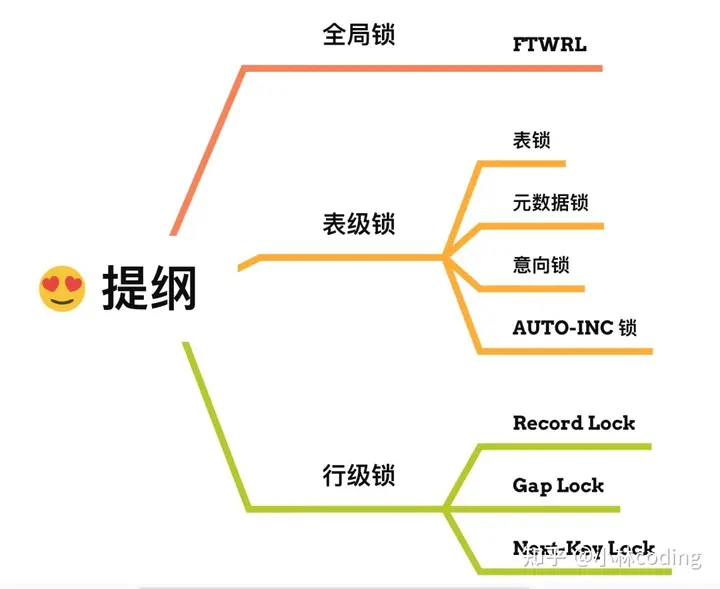
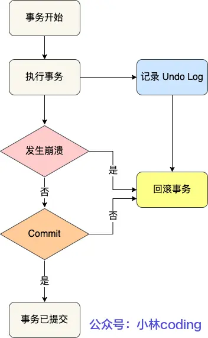
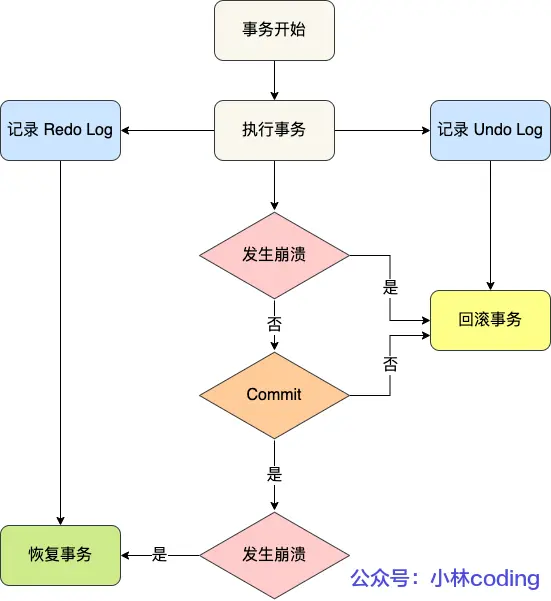
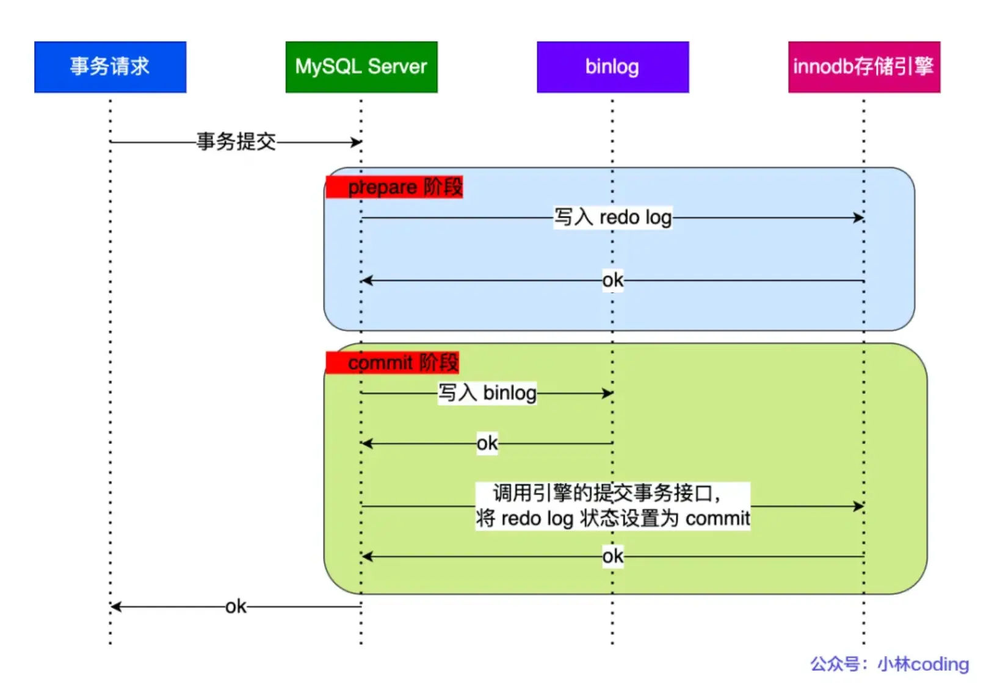
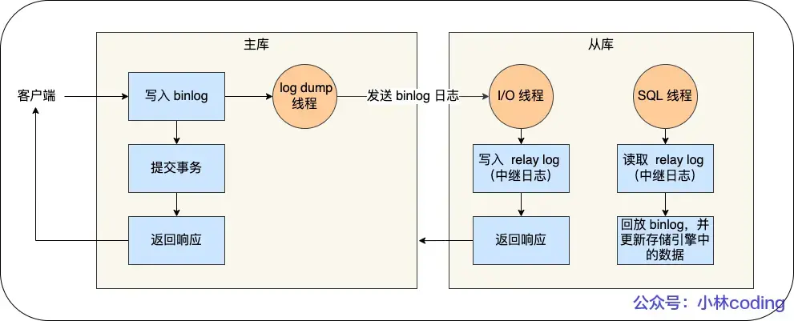

# SQL基础
## 数据库三大范式
- 第一范式（1NF）：数据表的每一列都是不可分割的原子项数据
- 第二范式（2NF）：在1NF的基础上，非码属性必须完全依赖于候选码属性。**需要确保数据库表中的每一列都和主键相关，而不能只与主键的某一部分相关**
- 第三范式（3NF）：在2NF的基础上，任何非主属性不依赖于其他非主属性。**需要确保数据表中的每一列数据都和主键直接相关，而不能间接相关**

## 数据库的联表查询类型
- **内连接**：返回两个表中有匹配关系的行
- **左外连接**：返回左表中的所有行，即使在右表中没有匹配的行。未匹配的右表列会包含NULL
- **右外连接**：返回右表中的所有行，即使左表中没有匹配的行。未匹配的左表列会包含NULL
- **全外连接**：返回两个表中所有行，包括非匹配行

## MySQL如何避免重复插入数据
- 使用**UNIQUE**约束：在表的相关列上添加UNIQUE约束，确保每个值在该列中唯一
- 使用**insert …… on duplicate update**：允许在插入记录时处理重复键的情况。如果插入的记录与现有记录冲突
- 使用**insert ignore**：在插入记录时忽略那些因重复键而导致的插入错误

## CHAR 和 VARCHAR的区别
CHAR是固定长度的字符串类型，VARCHAR是可变长度的字符串类型

## VARCHAR 后面代表字节还是字符
VARCHAR 后面括号里的数字代表的是字符数

## int(1) int(10) 在mysql有什么不同
INT(1) 和 INT(10) 的区别主要在于**显示宽度**，而不是存储范围或数据类型本身的大小。

## MySQL的关键字 in 和 exist
`in` 用于检查左边的表达式是否存在于右边的列表或子查询的结果集中

`exist` 用于判断子查询是否至少能返回一行数据。

- 性能差异：`exist` 一找到匹配项就停止，`in` 会扫描整个子查询结果
- 使用场景：`exist` 适用于**子查询涉及外部查询**的每一行判断， `in` 适用于子查询结果结果集较小
- NULL值处理：`in` 能够处理子查询中包含null值的情况，`exist` 不受子查询结果中null值的影响

## MySQL的基本函数
- 字符串函数：
    - **Concat(str1,str2,…)**：返回合并后的字符串
    - **length(str)**：返回字符串长度
    - **substring(str,pos,len)**：从pos位置开始截取len长度的子字符串
    - **replace(str,from_str,to_str)**：将str字符串中的from_str字符串替换为to_str字符串

- 数值函数：
    - **abs(num)**：返回绝对值
    - **power(num，e)**：返回num的e次幂结果

- 日期和时间函数
    - **now()**：返回当前日期和时间
    - **curdate()**：返回当前日期

- 聚合函数
    - **count(column)**：计算指定列的非null值的个数
    - **sum(column)**：计算指定列的总和
    - **avg(column)**：计算指定列的平均值
    - **max(column)**：返回指定列的最大值
    - **min(column)**：返回指定列的最小值
    - **rank()**：用于排名的函数

## SQL查询语句的执行顺序
所有的查询语句都是从FROM开始执行，在执行过程中，每个步骤都会生成一个虚拟表，这个虚拟表将作为下一个执行步骤的输入，最后一个步骤产生的虚拟表即为输出结果。

## 如何用MySQL实现可重入的锁
```java
create table lock_table(
    id int auto_increment primary key,
    // name存储锁的名称，作为锁的唯一标识
    name varchar(255) not null,
    // holder_thread持有该锁的线程名称
    holder_thread varchar(255),
    // count存储锁的重入次数
    count int default 0
);
```
- 加锁实现逻辑
    - 执行查询，`select holder_thread,count from lock_table where name=?` 判断锁是否存在
    - 不存在直接加锁。`insert into lock_table(name,holder_thread,count) values(?,?,1)`
    - 如果存在，更新count，增加重入次数

- 解锁实现逻辑
    - 执行查询，`select holder_thread,count from lock_table where name=?` 判断锁是否存在
    - 如果记录存在，且持有者是同一个线程，且可重入数大于 1 ，则减少重入次数
    - 如果记录存在，且持有者是同一个线程，且可重入数小于等于 0 ，则完全释放锁

# 存储引擎
## 执行一条SQL语句的过程
- 建立连接、校验身份
- 查询缓存，如果命中缓存直接返回
- 解析SQL语句
- 执行SQL语句
    - 检查表和字段是否存在
    - 选择查询成本最小的执行计划
    - 执行

## MySQL的引擎
- **InnoDB**：支持ACID事务、行级锁、外键约束。适用高并发的读写操作。
- **MyISAM**：较低存储空间和内存消耗，适用于大量读写操作。不支持ACID事务、行级锁、外键约束
- **Memory**：数据存储在内存中，适用于对性能较高的读操作。不支持ACID事务、行级锁、外键约束

## InnoDB的优势以及为什么是MySQL的默认引擎
- 事务支持：支持ACID（原子性、一致性、隔离性、持久性）
- 高并发：采用行级锁
- 崩溃恢复：过 redo log 日志实现了崩溃恢复

# 索引
## 索引的好处
查询时基于二分查找，通过索引快速定位到目标数据

## 索引的分类
- 数据结构分类：B+tree索引、Hash索引、Full-text索引

- 物理存储分类：
    - 聚簇索引（主键索引）：主键索引的 B+Tree 的叶子节点存放的是实际数据
    - 二级索引（辅助索引）：二级索引的 B+Tree 的叶子节点存放的是主键值，而不是实际数据。

- 字段类型分类
    - 逐渐索引：在创建表的时候一起创建，一张表最多只有一个主键索引，不允许空值。`primary key`
    - 唯一索引：一张表可以有多个唯一索引，索引列的值必须唯一，允许空值。`unique key`
    - 普通索引：建立在普通字段上的索引
    - 前缀索引：对字符类型字段的前几个字符建立的索引

- 字段个数分类：单列索引、联合索引（最左匹配原则）

## 聚簇索引和非聚簇索引的区别
- 数据存储：聚簇索引的叶子结点存储数据，非聚簇索引的叶子阶段存储指针或的主键值
- 索引和数据关系：聚簇索引不需要额外步骤查找数据所在位置。非聚簇索引需要根据主键值查找数据所在位置
- 唯一性：聚簇索引通常是主键唯一
- 效率：聚簇索引效率高

## 如果聚簇索引的数据更新，它的存储要不要变化
非索引数据更新数据结构不变，索引数据更新存储结构要变化维护B+树

## MySQL主键是聚簇索引吗？
是

如果有主键，默认主键是聚簇索引

如果没有主键，选择第一个不包含null值的唯一列作为聚簇索引的索引键

## 什么字段适合做主键
- 有唯一性
- 有递增趋势
- 不能使用业务数据

## 字段较少是用自增id还是uuid
建议自增id

uuid 相对顺序的自增 id 来说是毫无规律可言的，新行的值不一定要比之前的主键的值要大。

MySQL使用B+树是有序的，uuid无序插入会导致性能下降

uuid太占用内存

## B+树的特性
- 所以有叶子结点都在同一层
- 非叶子结点存储键值
- 叶子结点存储数据
- 自平衡：在插入、删除和更新操作后会自动重新平衡，确保树的高度保持相对稳定

## B+树和B树的区别
B树的非叶子节点既存储索引信息也存储部分数据。B+树叶子结点存储数据，非叶子结点存储键值

B+树叶子节点使用链表相连，B树没有

B+树查找性能更稳点，每次查找都需要查找到叶子结点

## B+树的好处
- B+ 树的非叶子节点不存放实际的记录数据，可以存放更多索引
- B+ 树有大量的冗余节点，插入、删除效率更高
- B+ 树叶子节点之间用链表连接了起来，有利于范围查询

## B+树的叶子节点链表是单向还是双向？
双向，为了实现倒序遍历或者排序

## 创建联合索引时需要注意什么
建立联合索引时，要把区分度大的字段排在前面，这样区分度大的字段越有可能被更多的 SQL 使用到。

## 索引失效的情况
- 使用左或者左右模糊匹配的时候
- 对索引列使用函数
- 对索引列进行表达式计算
- 索引列时字符串，并与数字进行比较时
- 没有遵循最左匹配原则
- 在 WHERE 子句中，如果 OR 连接的条件里有任何一个列没有建立索引

## 什么情况会回表查询
如果查询的数据不在二级索引里，就会先检索二级索引，找到对应的叶子节点，获取到主键值后，然后再检索主键索引，就能查询到数据了，这个过程就是回表。

## 什么是覆盖索引
一个索引包含了查询所需的所有列，因此不需要访问表中的数据行就能完成查询。

## 如果一个列即使单列索引，又是联合索引，单独查它的话先走哪个？
优化器会选择联合索引，因为查询成本更低，查询也不需要回表，直接索引覆盖了。

## 索引字段是不是建的越多越好？
不是，建的的越多会占用越多的空间，而且在写入频繁的场景下，对于B+树的维护所付出的性能消耗也会越大

## 索引的缺点
- 需要更大的物理空间
- 创建和维护索引需要耗费时间
- 降低增删改的效率

## 什么适用索引
- 字段有唯一性
- 常用于where 查询条件的字段
- 常用于group by或者 order by的字段

## 什么不适用索引
- 不常用于where、group by、order by的字段
- 字段中存在大量重复数据
- 表数据过少
- 经常更新的字段

## 索引优化的方法
- 前缀索引优化：在一些大字符串的字段作为索引时，使用前缀索引可以帮助我们减小索引项的大小。
- 覆盖索引优化：避免回表查询
- 主键索引最好子等
- 避免索引失效

# 事务
## 事务的特性是什么？
- **原子性**：一个事务中的所有操作要么全部完成，要么全部不完成。通过**回滚日志**实现
- **一致性**：事务操作前和事务操作后，数据库保持一致性状态。通过**持久性+原子性+隔离性**实现
- **隔离性**：数据库允许多个并发事务同时对数据进行读写和修改，隔离性可以防止多个事务并发执行时由于交叉执行而导致数据的不一致。通过**MVCC（多版本并发控制）**或**锁机制**实现
- **持久性**：事务处理结束后，对数据的修改是永久的。通过**重做日志**实现。

## MySQL可能出现什么和并发相关问题？
- **脏读**：一个事务「**读到**」了另一个「**未提交事务修改过的数据**」
- **不可重复度**：在一个事务内多次读取同一个数据，如果出现前后两次读到的数据不一样的情况
- **幻读**：在一个事务内多次查询某个符合查询条件的「记录数量」，如果出现前后两次查询到的记录数量不一样的情况

## MySQL解决并发问题的方案
- **锁机制**：在读写操作时对数据进行加锁，确保同时只有一个操作能够访问或修改数据
- **事务隔离级别**：设置合适的事务隔离级别，可以在多个事务并发执行时，控制事务之间的隔离程度，避免数据不一致的问题
- **MVCC（多版本并发控制）**：在数据库中保存不同版本的数据来实现不同事务之间的隔离

## 事务的隔离级别
- 读未提交：事务未提交，对数据库的变更能被其他事务看到
- 读提交：通过 **Read View** 来实现。事务只有提交后，变更才能被其他事务看到
- 可重复读：通过 **Read View** 来实现。事务执行过程中看到的数据更事务启动时看到的数据一致。(**MySQL默认隔离级别**)
- 串行化：通过加**读写锁**实现，在多个事务对这条记录进行读写操作时，如果发生了读写冲突的时候，后访问的事务必须等前一个事务执行完成，才能继续执行

「读提交」隔离级别是在「每个语句执行前」都会重新生成一个 Read View

「可重复读」隔离级别是「启动事务时」生成一个 Read View，然后整个事务期间都在用这个 Read View。

## Mysql 设置了可重读隔离级后，怎么保证不发生幻读？
设置可重读隔离级后仍可能发生幻读

在事务开启后，马上执行 `select … for update` 对next-key lock，避免幻读问题

## 串行化隔离级别是通过什么实现的
通过行级锁来实现的。在串行化隔离级别下，普通的 select 查询会对记录加 S 型的 next-key 锁，其他事务就没办法对这些已经加锁的记录进行增删改操作了。

## MVCC原理
对于「读提交」和「可重复读」隔离级别的事务，通过 Read View 来实现

「读提交」隔离级别是在「每个select语句执行前」都会重新生成一个 Read View

「可重复读」隔离级别是执行第一条select时，生成一个 Read View，然后整个事务期间都在用这个 Read View。

## 一条update是不是原子性的？为什么？
是原子性

执行 update 的时候，会加行级别锁

事务执行过程中，会生成 undolog，如果事务执行失败，就可以通过 undolog 日志进行回滚

## 如果一个事务特别多 sql带来的问题
- 数据太多会造成思索和锁超时
- 会占用大量存储空间
- 事务回滚时间会变长
- 会造成主从延迟

# 锁
## MySQL里有哪些锁

- **全局锁**：通过 `flush tables with read lock` 语句会将整个数据库就处于只读状态。全局锁主要应用于做**全库逻辑备份**

- **表级锁**：
    - **表锁**：lock tables 语句可以对表加表锁，限制别的线程和本线程接下来的读写操作
    - **元数据锁**：对数据库表进行操作时，自动给这个表加上 MDL。避免其他线程对表结构做更改
    - **意向锁**：当执行插入、更新、删除操作，需要先对表加上「意向独占锁」，然后对该记录加独占锁。目的是为了**快速判断表里是否有记录被加锁**。

- **行级锁**：
    - **记录锁**：锁住的是一条记录。记录锁是有 S 锁和 X 锁之分的，满足读写互斥，写写互斥。
    - **间隙锁**：只存在**可重复读写隔离级别**，为了解决可重复读隔离级别下幻读的现象。
    - **临键锁**：记录锁+间隙锁的组合，锁定一个范围，并且锁定记录本身

## 表锁和行锁的作用
- 表锁：
    - 整体控制：当一个事务获取了表锁时，其他事务无法对该表进行任何读写操作
    - 粒度大：会影响到整个表的其他操作，可能会引起锁竞争和性能问题
    - 适用于大批量操作

- 行锁
    - 细粒度控制：提高并发性
    - 减少锁冲突：提高了并发访问的效率。
    - 适用于频繁单行操作

## MySQL两个线程的update语句同时处理一条数据，会不会有阻塞？
会引发堵塞，因为MySQL是行级锁，当A事务对数据进行处理时会该行数据进行加锁。

## MySQL两个线程的update语句同时处理一条数据，会不会有阻塞？
不会，因为锁住的范围不一样

## 如果2个范围不是主键或索引？还会阻塞吗？
会堵塞，因为如果不是索引的话会触发全表扫描。全部索引都会加上**行级锁**。

# 日志
## 日志分为哪几种？
- **重做日志（redo log）**：实现了事务中的**持久性**，主要用于**掉电等故障恢复**
- **回滚日志（undo log）**：实现了事务中的**原子性**，主要用于**事务回滚**和 **MVCC**
- **二进制日志（bin log）**：是 Server 层生成的日志，主要用于**数据备份**和**主从复制**。binlog 是追加写，写满一个文件，就创建一个新的文件继续写，不会覆盖以前的日志。binlog 文件是记录了**所有数据库表结构变更**和**表数据修改的日志**
- **中继日志（relay log）**：用于**主从复制**。通过io线程拷贝master的bin log后生成本地日志
- **慢查询日志**：用于记录执行时间过长的sql

## UndoLog日志的作用是什么

在事务没提交之前，MySQL 会先记录更新前的数据到 undo log 日志文件里面，当事务回滚时，可以利用 undo log 来进行回滚。

## 有了undolog为啥还需要redolog呢？
undolog是基于内存的，一旦断电就会导致数据丢失。redolog是物理日志，记录了某个数据页做了什么修改。

- redo log 记录了此次事务「完成后」的数据状态，记录的是更新之后的值
- undo log 记录了此次事务「开始前」的数据状态，记录的是更新之前的值

## redolog是如何保证持久性的
1. 在事务提交之前，将事务所做的修改操作记录到redo log中，然后再将数据写入磁盘。
2. redo log采用追加写入的方式，将redo日志记录追加到文件末尾
3. MySQL会定期将内存中的数据刷新到磁盘，同时将最新的LSN（Log Sequence Number）记录到磁盘中。在恢复数据时，系统会根据 **LSN** 来确定从哪个位置开始应用redo log。

## 能不能只用binlog不用relo log
不行，binlog是 server 层的日志，没办法记录哪些脏页还没有刷盘，redolog 是存储引擎层的日志，可以记录哪些脏页还没有刷盘，这样崩溃恢复的时候，就能恢复那些还没有被刷盘的脏页数据

## binlog 两阶段提交过程是怎么样的

- **prepare阶段**：将内部 XA 事务的 ID 写入到 redo log，同时将 redo log 对应的事务状态设置为 prepare，然后将 redo log 持久化到磁盘
- **commit阶段**：把内部 XA 事务的 ID  写入到 binlog，然后将 binlog 持久化到磁盘。将 redo log 状态设置为 commit，此时该状态并不需要持久化到磁盘。

## MySQL如何保障数据不丢失
通过 redolog 来实现事务持久性的。事务执行过程，会把对 innodb 存储引擎中数据页修改操作记录到 redolog 里，事务提交的时候，就直接把 redolog 刷入磁盘，即使脏页中途没有刷盘成功， mysql 宕机了，也能通过 redolog 重放，恢复到之前事务修改数据页后的状态，从而保障了数据不丢失。

## RedoLog是在内存里吗
事务执行过程中，在内存中。事务提交时写入磁盘

## 为什么要写RedoLog，而不是直接写到B+树里面
因为 redolog 写入磁盘是顺序写，而 b+树里数据页写入磁盘是随机写，顺序写的性能会比随机写好，这样可以提升事务提交的效率。

# 性能调优
## mysql的explain有什么作用
explain 是查看 sql 的执行计划，主要用来分析 sql 语句的执行过程，比如有没有走索引，有没有外部排序，有没有索引覆盖等等

## 怎么查看是否有走索引
在SQL语句前面加explain，执行后会返回一张执行计划表

- 看type字段：type 字段如果是 ref、eq_ref 或者 const，说明走了索引
- 看key字段：如果 key 是 NULL，就说明没走索引

## 如何查看表的索引
SHOW INDEX命令能清晰列出表的所有索引信息，包括索引名、索引类型、对应字段、是否主键等。
```
show index from table_name 
```
执行后会返回多列结果，关键信息很直观：
- Key_name 是索引名称
- Column_name 是索引对应的字段
- Index_type 是索引类型
- Non_unique 字段为 0 表示唯一索引,为 1 表示普通非唯一索

## 给你张表，发现查询速度很慢，你有那些解决方案
- **分析查询语句**：通过explain分析SQL语句是否存在全表扫描，是否存在索引未被利用的情况等
- **创建或优化索引**：根据查询条件创建合适的索引，经常用于WHERE子句的字段、Orderby 排序的字段、Join 连表查询的字典、 group by的字段，
- **查询优化**：避免使用SELECT *，只查询真正需要的列。使用覆盖索引，即索引包含所有查询的字段
- **优化数据库表**：将大表拆分为小表，将字段多的表分解成多个表
- **使用缓存技术**：引入缓存层，如Redis，存储热点数据和频繁查询的结果

# 架构
## MySQL的主从复制

- **写入 Binlog**：主库写 binlog 日志，提交事务，并更新本地存储数据。
- **同步 Binlog**：把 binlog 复制到所有从库上，每个从库把 binlog 写到暂存日志中。
- **回放 Binlog**：回放 binlog，并更新存储引擎中的数据。

## 主从延迟都有什么处理方法
**强制走主库方案**：对于大事务或资源密集型操作，直接在主库上执行，避免从库的额外延迟。

