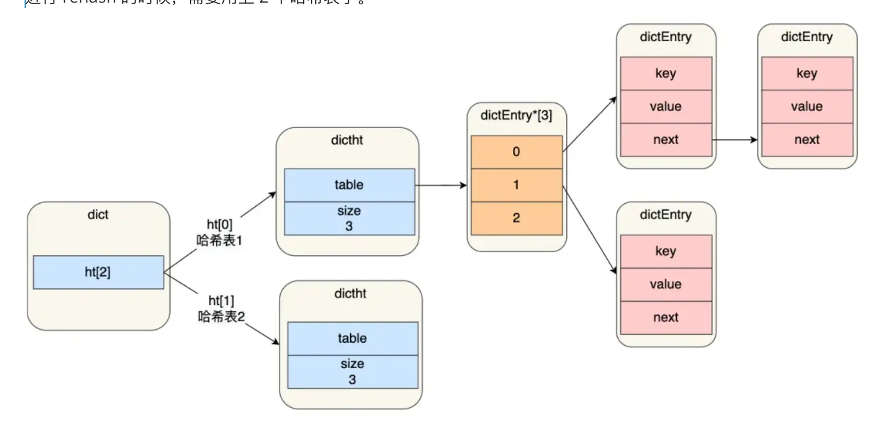
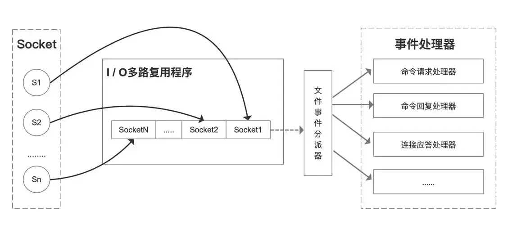
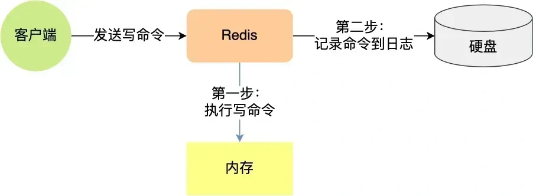
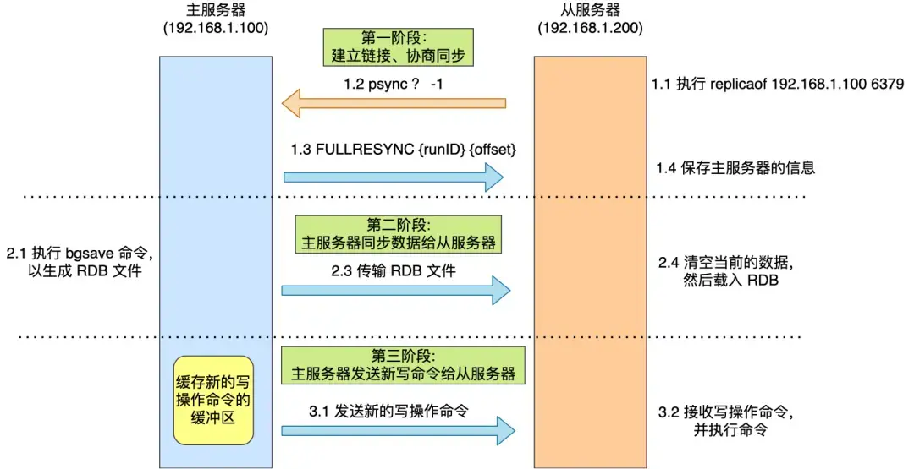
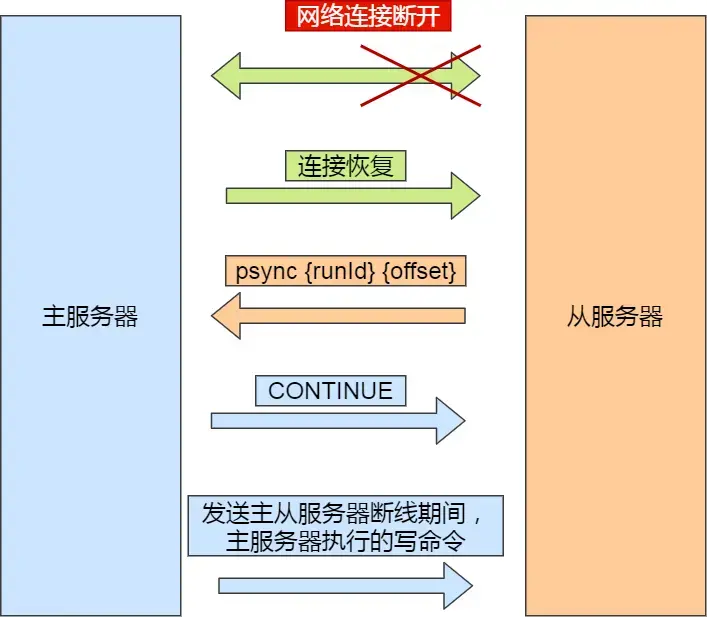
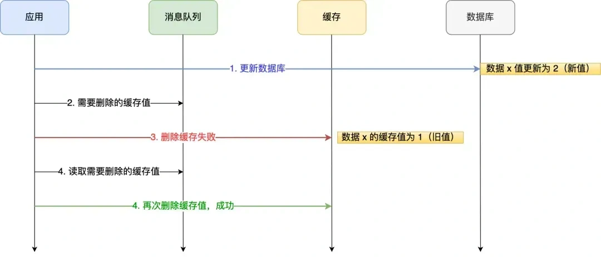

# Redis数据结构
## 五个基本数据结构
- **String类型**：一个 key 对应一个 value。用于缓存对象、常规计数、分布式锁、共享session
    - 设置键值：`SET key value`
    - 获取值：`GET key`
    - 一次设置多个键值：`MSET k1 v1 k2 v2`
    - 一次获取多个值：`MGET k1 k2`
    - key 不存在时才设置：`SETNX key value`
    - 设置值并指定过期时间：`SETEX key seconds value`
    - 数值加 1：`INCR key`
    - 数值增加 n：`INCRBY key n`
    - 数值减 1：`DECR key`
    - 数值减少 n：`DECRBY key n`
    - 在字符串末尾追加：`APPEND key value`
    - 获取字符串长度：`STRLEN key`
- **List类型**：有序、可重复的字符串集合，对两端进行push和pop操作、根据值查找和删除元素。用于消息队列
    - 从左侧插入：`LPUSH key value`
    - 从右侧插入：`RPUSH key value`
    - 从左侧弹出一个元素：`LPOP key`
    - 从右侧弹出一个元素：`RPOP key`
    - 查询指定范围元素：`LRANGE key start stop`
    - 根据下标获取元素：`LINDEX key index`
    - 获取列表长度：`LLEN key`
    - 删除指定元素：`LREM key count value`
    - 修改指定下标元素：`LSET key index value`
    - 只保留指定范围：`LTRIM key start stop`
- **Hash类型**：存储格式可以理解成：`key -> field -> value`,一个 Redis key 下面，可以存很多组 field-value 键值对。用于缓存对象、购物车
    - 设置字段：`HSET key field value`
    - 获取字段：`HGET key field`
    - 获取多个字段：`HMGET key field1 field2`
    - 获取所有字段和值：`HGETALL key`
    - 删除字段：`HDEL key field`
    - 判断字段是否存在：`HEXISTS key field`
    - 获取所有 field：`HKEYS key`
    - 获取所有 value：`HVALS key`
    - 获取字段数量：`HLEN key`
    - 数值字段增加 n：`HINCRBY key field n`
- **Set类型**：无序、不可重复的字符串集合，用于聚合计算（并集、交集、差集），比如点赞、共同关注、抽奖活动
    - 添加元素：`SADD key member`
    - 删除元素：`SREM key member`
    - 获取所有元素：`SMEMBERS key`
    - 判断元素是否存在：`SISMEMBER key member`
    - 获取元素数量：`SCARD key`
    - 随机弹出元素：`SPOP key`
    - 随机获取元素但不删除：`SRANDMEMBER key`
    - 求交集：`SINTER key1 key2`
    - 求并集：`SUNION key1 key2`
    - 求差集：`SDIFF key1 key2`
- **Zset类型**：包含键值对的列表，元素不可重复，但每个元素都有一个 score，根据 score 排序。如排行榜、电话和姓名排序
    - 添加元素：`ZADD key score member`
    - 删除元素：`ZREM key member`
    - 按 score 从小到大查询：`ZRANGE key start stop`
    - 按 score 从大到小查询：`ZREVRANGE key start stop`
    - 查询成员分数：`ZSCORE key member`
    - 查询升序排名：`ZRANK key member`
    - 查询降序排名：`ZREVRANK key member`
    - 获取元素个数：`ZCARD key`
    - 增加成员 score：`ZINCRBY key n member`
    - 统计分数范围内元素数量：`ZCOUNT key min max`
    - 按分数范围查询：`ZRANGEBYSCORE key min max`

## Zset使用跳表实现，跳表如何实现
跳表在创建节点时候，会生成范围为[0-1]的一个随机数，如果这个随机数小于 0.25（相当于概率 25%），那么层数就增加 1 层，然后继续生成下一个随机数，直到随机数的结果大于 0.25 结束，最终确定该节点的层数。

## Hash是如何扩容的

渐进式Rehash步骤： 
1、给「哈希表 2」分配空间 
2、将「哈希表 1 」的数据迁移到「哈希表 2」 中；再次期间，每次哈希表元素进行新增、删除、查找或者更新操作时，Redis 除了会执行对应的操作之外，还会顺序将「哈希表 1 」中索引位置上的所有 key-value 迁移到「哈希表 2」 上； 
3、随着处理客户端发起的哈希表操作请求数量越多，最终在某个时间点会把「哈希表 1 」的所有 key-value 迁移到「哈希表 2」。迁移完成后，「哈希表 1 」的空间会被释放，并把「哈希表 2」 设置为「哈希表 1」，然后在「哈希表 2」 新创建一个空白的哈希表，为下次 rehash 做准备。

## 哈希表扩容的时候，有读请求怎么查？
先会在「哈希表 1」 里面进行查找，如果没找到，就会继续到哈希表 2 里面进行找到。

# Redis线程模型
## Redis快速的原因
1、Redis 的大部分操作都在内存中完成，并且采用了高效的数据结构 
2、Redis 采用单线程模型可以避免了多线程之间的竞争 
3、Redis 采用了 I/O 多路复用机制处理大量的客户端 Socket 请求

## Redis的单线程和Redis程序多线程分别指什么。
Redis 单线程指的是「接收客户端请求->解析请求 ->进行数据读写等操作->发送数据给客户端」这个过程是由一个线程（主线程）来完成的

但是，Redis 程序并不是单线程的，Redis 在启动的时候，是会启动后台线程（BIO）的（分别异步处理关闭文件任务、AOF 刷盘任务、释放内存任务。）

## Redis 的 I/O 多路复用模型

- 一个 socket 客户端与服务端连接时，会生成对应一个套接字描述符（套接字描述符是文件描述符的一种），每一个 socket 网络连接其实都对应一个文件描述符。
- 多个客户端与服务端连接时，Redis 使用 I/O 多路复用程序将客户端 socket 对应的 FD 注册到监听列表（一个队列）中。当客户端执行 read、write 等操作命令时，I/O 多路复用程序会将命令封装成一个事件，并绑定到对应的 FD 上。
- 文件事件处理器使用 I/O 多路复用模块同时监控多个文件描述符（fd）的读写情况，当 accept、read、write 和 close 文件事件产生时，文件事件处理器就会回调 FD 绑定的事件处理器进行处理相关命令操作。

# Redis事务
## 如何实现Redis的原子性
- redis 执行一条命令的时候是具备原子性的。因为 redis 执行命令的时候是单线程来处理的，不存在多线程安全的问题。
- 如果要保证 2 条命令的原子性的话，可以考虑用 lua 脚本，将多个操作写到一个 Lua 脚本中，Redis 会把整个 Lua 脚本作为一个整体执行，在执行的过程中不会被其他命令打断，从而保证了 Lua 脚本中操作的原子性。
- redis 事务也可以保证多个操作的原子性。如果 redis 事务正常执行，没有发生任何错误，那么使用 MULTI 和 EXEC 配合使用，就可以保证多个操作都完成。**但是，如果事务执行发生错误了，就没办法保证原子性了。**

# Redis日志
## Redis的持久化方式
### AOF日志

Redis 在执行完一条写操作命令后，就会把该命令以追加的方式写入到一个文件里，然后 Redis 重启时，会读取该文件记录的命令，然后逐一执行命令的方式来进行数据恢复。

三种落盘策略： 
1、Always，每次写操作命令执行完后，都立即调用`fsync()` 将 AOF 日志数据同步刷到硬盘，数据安全性最高，但性能最差 
2、Everysec，先把命令写入 `aof_buf`，再由主线程调用 `write()` 写到内核 page cache，然后每隔 1 秒由后台线程调用一次 `fsync()` 将 page cache 中的内容刷到硬盘，发生宕机时最多丢失约 1 秒的数据； 
3、No，不主动调用 `fsync()`，只负责 `write()` 到内核 page cache，由操作系统自行决定何时刷盘。性能最好但宕机时丢失数据量不可控。

### RDB快照
RDB 快照就是记录某一个瞬间的内存数据，记录的是**实际数据**。

### AOF和RDB的优缺点
**AOF**： 
优点： 
- AOF提供了更好的数据安全性，因为它默认每接收到一个写命令就会追加到文件末尾。即使Redis服务器宕机，也只会丢失最后一次写入前的数据。
- AOF支持多种同步策略（如everysec、always等），可以根据需要调整数据安全性和性能之间的平衡。
- AOF文件在Redis启动时可以通过重写机制优化，减少文件体积，加快恢复速度。
- AOF还提供了redis-check-aof工具来修复损坏的文件。

缺点： 
- 因为记录了每一个写操作，所以AOF文件通常比RDB文件更大，消耗更多的磁盘空间
- 频繁的磁盘IO操作（尤其是同步策略设置为always时）可能会对Redis的写入性能造成一定影响。
- 当某个文件体积过大时，AOF会进行重写操作，AOF如果没有开启AOF重写或者重写频率较低，恢复过程可能较慢

**RDB**： 
优点： 
- RDB通过快照的形式保存某一时刻的数据状态，文件体积小，备份和恢复的速度非常快。
- RDB是在主线程之外通过fork子进程来进行的，不会阻塞服务器处理命令请求，对Redis服务的性能影响较小。
- 由于是定期快照，RDB文件通常比AOF文件小得多。

缺点： 
- RDB方式在两次快照之间，如果Redis服务器发生故障，这段时间的数据将会丢失。
- 如果在RDB创建快照到恢复期间有写操作，恢复后的数据可能与故障前的数据不完全一致

### 混合持久化

# 缓存淘汰和过期删除
## 过期删除策略和内存淘汰策略有什么区别？
- 内存淘汰策略是在内存满了的时候，redis 会触发内存淘汰策略，来淘汰一些不必要的内存资源，以腾出空间，来保存新的内容
- 过期键删除策略是将已过期的键值对进行删除。

## 内存淘汰策略
**不进行数据淘汰策略**： 
如果有新的数据写入，会报错通知禁止写入，不淘汰任何数据。查询和删除操作可以正常进行

**进行数据淘汰策略**： 
- 在过期时间的数据进行淘汰：
    - **volatile-random**：随机淘汰任意键值。
    - **volatile-ttl**：优先淘汰更早过期的键值
    - **volatile-lru**：淘汰最久未使用的键值
    - **volatile-lfu**：淘汰最少使用的键值

- 在所有数据范围进行淘汰
    - **allkeys-random**：随机淘汰任意键值。
    - **allkeys-lru**：淘汰最久未使用的键值
    - **allkeys-lfu**：淘汰最少使用的键值

## 过期删除策略
Redis 选择「**惰性删除+定期删除**」这两种策略配和使用。

Redis缓存失效**不会**立即删除，因为：**在过期 key 比较多的情况下，删除过期 key 可能会占用相当一部分 CPU 时间，在内存不紧张但 CPU 时间紧张的情况下，将 CPU 时间用于删除和当前任务无关的过期键上，无疑会对服务器的响应时间和吞吐量造成影响。**

惰性删除策略
- 如果过期，则删除该 key，至于选择异步删除，还是选择同步删除，根据 lazyfree_lazy_expire 参数配置决定
- 如果没有过期，不做任何处理，然后返回正常的键值对给客户端

定期删除策略：
- Redis 的定期删除是每隔一段时间「随机」从数据库中取出一定数量的 key 进行检查，并删除其中的过期key。
- 具体流程如下：
    - 从过期字典中随机抽取 20 个 key
    - 检查这 20 个 key 是否过期，并删除已过期的 key
    - 如果本轮检查的已过期 key 的数量，超过 5 个，也就是「已过期 key 的数量」占比「随机抽取 key 的数量」大于 25%，则继续重复步骤 1；如果已过期的 key 比例小于 25%，则停止继续删除过期 key，然后等待下一轮再检查。

# Redis集群
## Redis的完全同步
完全同步发生在以下几种情况：
- 初次同步：当一个从服务器首次连接到主服务器时，会进行一次完全同步
- 从服务器数据丢失：如果从服务器数据由于某种原因（如断电）丢失，它会请求进行完全同步。
- 主服务器数据发生变化：如果从服务器长时间未与主服务器同步，导致数据差异太大，也可能触发完全同步。

**完全同步实现流程**：

1. **从服务器发送SYNC命令**：从服务器向主服务器发送`SYNC`命令，请求开始同步
2. **主服务器生成RDB快照**：接收到SYNC命令后，主服务器会保存当前数据集的状态到一个临时文件。
3. **传输RDB文件**：主服务器将生成的RDB文件发送给从服务器。
4. **从服务器接收并应用RDB文件**：从服务器接收RDB文件后，会清空当前的数据集，并载入RDB文件中的数据。
5. **主服务器记录写命令**：在RDB文件生成和传输期间，主服务器会记录所有接收到的写命令到`replication backlog buffer`
6. 传输写命令：一旦RDB文件传输完成，主服务器会将`replication backlog buffer`中的命令发送给从服务器，从服务器会执行这些命令，以保证数据的一致性。

## Redis的增量同步
增量同步允许从服务器从断点处继续同步，而不是每次都进行完全同步。

1. 在主服务器进行命令传播时，不仅会将写命令发送给从服务器，还会将写命令写入到 `repl_backlog_buffer` 缓冲区里，因此 这个缓冲区里会保存着最近传播的写命令。
2. 网络断开后，当从服务器重新连上主服务器时，从服务器会通过 `psync` 命令将自己的复制偏移量`slave_repl_offset` 发送给主服务器，主服务器根据自己的`master_repl_offset` 和 `slave_repl_offset` 之间的差距，然后来决定对从服务器执行哪种同步操作:在`repl_backlog_buffer` 缓冲区里用**增量同步**，不在用**完全同步**

## Redis哨兵机制
哨兵会监测主节点是否存活，如果发现主节点挂了，就会选举一个从节点切换为主节点，并且把新主节点的相关信息通知给从节点和客户端。

当redis集群的主节点故障时，Sentinel集群将从剩余的从节点中选举一个新的主节点，有以下步骤：
- **故障节点主观下线**：Sentinel集群对redis集群的所有节点发心跳包检测节点是否正常。如果一定时间内没有回复，认为主观下线
- **故障节点客观下线**：Sentinel节点会询问其他Sentinel节点，如果Sentinel集群中超过数量的Sentinel节点认为该redis节点主观下线，则该redis客观下线
- **Sentinel集群选举Leader**：每一个Sentinel节点都可以成为Leader，当一个Sentinel节点确认redis集群的主节点主观下线后，会请求其他Sentinel节点要求将自己选举为Leader。被请求的Sentinel节点如果没有同意过其他Sentinel节点的选举请求，则同意该请求。如果一个Sentinel节点获得的选举票数达到Leader最低票数，则该Sentinel节点选举为Leader
- **Sentinel Leader决定新主节点**：过滤故障的节点 -> 选择优先级slave-priority最大的从节点作为主节点 -> 选择复制偏移量最大的从节点作为主节点 -> 选择runidredis每次启动的时候生成随机的runid作为redis的标识）最小的从节点作为主节点

## Redis集群的优缺点
优点：
- **高可用性**：节点之间采用主从复制机制，可以保证数据的持久性和容错能力，哪怕其中一个节点挂掉，整个集群还可以继续工作。
- **高性能**：当业务访问量大到单机Redis无法满足时，可以通过添加节点来增加集群的吞吐量。
- **扩展性好**：可以根据实际需求动态增加或减少节点，从而实现可扩展性。

缺点：
- **部署和维护较复杂**
- **集群同步问题**：当某些节点失败或者网络出故障，集群中数据同步的问题也会出现。
- **数据分片限制**：如在一个key上修改多次，可能会因为该key所在的节点位置变化而失败。由于将数据分散存储到各个节点，某些操作不能跨节点实现

# Redis场景应用面试题
## 为什么使用redis？
因为 Redis 具备「**高性能**」（操作 Redis 缓存就是直接操作内存，所以速度相当快）和「**高并发**」（Redis 单机的 QPS 能轻松破 10w）两种特性。

## 本地缓存和Redis缓存的区别？
本地缓存：
- 优点：
    - 访问速度快
    - 减轻网络压力
    - 低延迟
- 缺点：
    - 可扩展性有限

Redis缓存：
- 优点：
    - 可扩展性强
    - 数据一致性高
    - 易于维护
- 缺点：
    - 访问速度相对较慢
    - 网络开销大

## Redis分布式锁的实现原理？什么场景下用到分布式锁？
分布式锁是用于分布式环境下并发控制的一种机制，用于控制某个资源在同一时刻只能被一个应用所使用。

满足加锁的三个条件：
- 加锁包括了读取锁变量、检查锁变量值和设置锁变量值三个操作，但需要以原子操作的方式完成。（使用 SET 命令带上 NX 选项来实现加锁）
- 锁变量需要设置过期时间，以免客户端拿到锁后发生异常，导致锁一直无法释放。（在 SET 命令执行时加上 EX/PX 选项，设置其过期时间）
- 锁变量的值需要能区分来自不同客户端的加锁操作，以免在释放锁时，出现误释放操作。（使用 SET 命令设置锁变量值时，每个客户端设置的值是一个唯一值，用于标识客户端）

## 大Key问题的缺点
- 内存占用过高
- 性能下降
- 阻塞其他操作
- 网络拥塞
- 主从同步延迟
- 数据倾斜

## 大Key问题如何解决
- 对大Key进行拆分
- 对大Key进行清理
- 监控Redis的内存水位。可以通过监控系统设置合理的Redis内存报警阈值进行提醒
- 对过期数据进行定期清。

## 热Key问题如何解决
- 在Redis集群架构中对热Key进行复制。
- 使用读写分离架构。

## 如何保证 redis 和 mysql 数据缓存一致性问题？
删除缓存重试策略（消息队列）：

- 将第二个操作（删除缓存）要操作的数据加入到消息队列，由消费者来操作数据。
- 如果应用删除缓存失败，可以从消息队列中重新读取数据，然后再次删除缓存，这个就是**重试机制**。
- 如果删除缓存成功，就要把数据从消息队列中移除，避免重复操作，否则就继续重试。

订阅 MySQL binlog，再操作缓存:
- 更新数据库，那么更新数据库成功，就会产生一条变更日志，记录在 binlog 里。
- 通过订阅 binlog 日志，拿到具体要操作的数据，然后再执行缓存删除

## 缓存雪崩、击穿、穿透是什么？怎么解决？
**缓存雪崩**：当**大量缓存数据在同一时间过期（失效）或者 Redis 故障宕机时**，如果此时有大量的用户请求，都无法在 Redis 中处理，于是全部请求都直接访问数据库，从而导致数据库的压力骤增，严重的会造成数据库宕机
- 解决方案
    - 均匀设置过期时间：对缓存数据设置过期时间时，给这些数据的过期时间加上一个随机数。
    - 互斥锁：当业务线程在处理用户请求时，如果发现访问的数据不在 Redis 里，就加个互斥锁，保证**同一时间内只有一个请求来构建缓存**。
    - 后台更新缓存：业务线程让缓存“永久有效”，并将更新缓存的工作交由后台线程定时更新。

**缓存击穿**：如果缓存中的某个**热点数据**过期了，此时大量的请求访问了该热点数据，就无法从缓存中读取，直接访问数据库，数据库很容易就被高并发的请求冲垮
- 解决方案
    - 互斥锁方案，保证同一时间只有一个业务线程更新缓存。
    - 不给热点数据设置过期时间，由后台异步更新缓存

**缓存穿透**：当用户访问的数据，**既不在缓存中，也不在数据库中**，导致请求在访问缓存时，发现缓存缺失，再去访问数据库时，发现数据库中也没有要访问的数据，办法构建缓存数据，来服务后续的请求。那么当有大量这样的请求到来时，数据库的压力骤增
- 解决方案
    - 非法请求的限制：在 API 入口处我们要判断求请求参数是否合理，请求参数是否含有非法值、请求字段是否存在
    - 缓存空值或者默认值：针对查询的数据，在缓存中设置一个空值或者默认值，这样后续请求就可以从缓存中读取到空值或者默认值
    - 布隆过滤器：使用布隆过滤器做个标记，然后在用户请求到来时，业务线程确认缓存失效后，可以通过查询布隆过滤器快速判断数据是否存在，如果不存在，就不用通过查询数据库来判断数据是否存在。

## 如何设计秒杀场景处理高并发以及超卖现象？
数据库层面：
- 在查询商品库存时加排他锁
- 更新数据库减库存的时候，进行库存限制条件

利用分布式锁
- 同一个锁key，同一时间只能有一个客户端拿到锁，其他客户端会陷入无限的等待来尝试获取那个锁

利用分布式锁+分段缓存
- 把数据分成很多个段，每个段是一个单独的锁，所以多个线程过来并发修改数据的时候，可以并发的修改不同段的数据

利用redis的incr、decr的原子性 + 异步队列