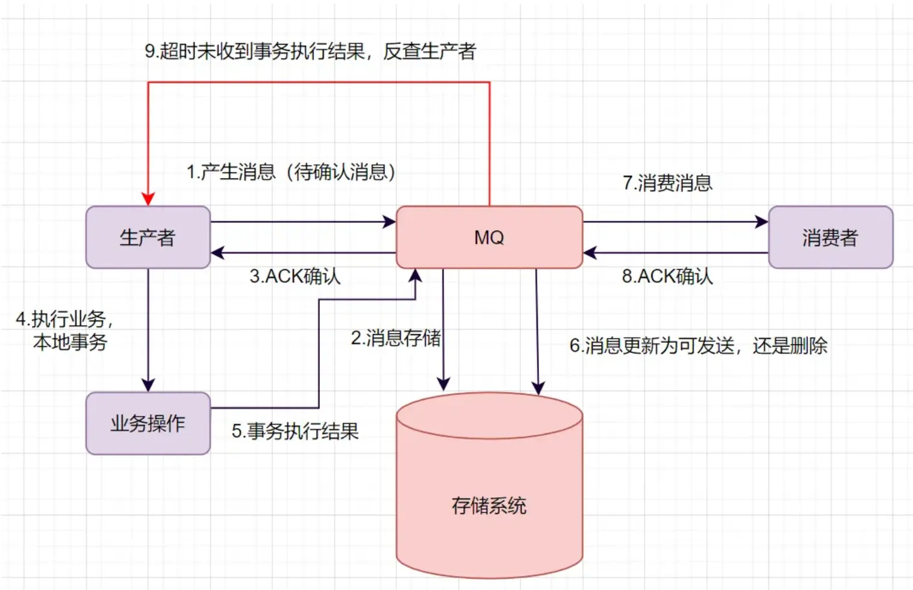
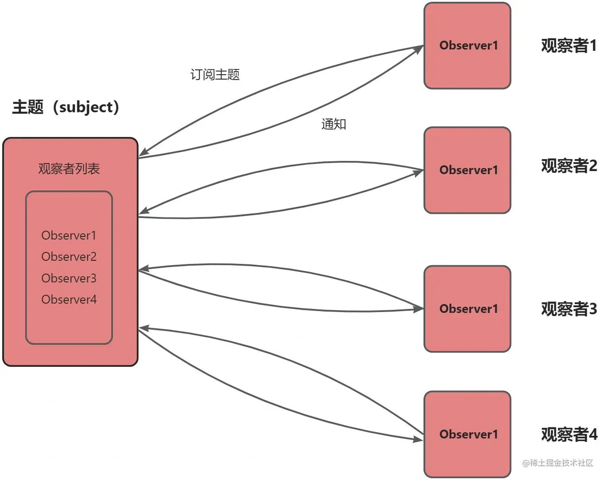

# 什么是消息队列
**使用队列来通信**的组件。它的本质，就是个**转发器**，包含**发消息**、**存消息**、**消费消息**的过程。

通常说的消息队列，简称MQ（Message Queue），它其实就指消息中间件

# 为什么需要消息队列
- 解耦：将一整个连续的系统拆分为多个子系统。某个子系统完成任务后将消息发送给消息队列，后续其他子系统需要这个消息自己从消息队列中获取。达到了物理和逻辑上的彻底解耦，系统容错率极高。
- 异步：例如完成发消息、加积分等任务。主系统直接将章台改掉，然后往消息队列发生消息。前端可以直接响应，剩余步骤可以让系统在后台顺着消息队列慢慢完成。
- 削峰填谷：当遇到高并发的场景时，例如促销、秒杀等，将所有消息放进消息队列，后端证据自己的数据库抗压能力慢慢从消息队列中取消息完成任务。

# 消息队列的缺点
- 系统**整体的可用性**反而变低了。如果消息队列故障，整个系统都不能使用
- 系统开发的复杂度上升。
- 数据一致性问题。

# 消息队列怎么选型
- 大量消息流的任务，看吞吐量，如千级的RocketMQ，百万级的RabbitMQ
- 金融类，安全性要求高，分布式部署的Kafka和Rocket就更有优势。

# 消息重复消费怎么解决
对于已经消费成功的消息，本地数据库表或Redis缓存业务标识，每次处理前先进行校验，保证幂等。

# 消息丢失怎么解决
- **消息生产阶段**：生产者提交消息到MQ，收到MQ回传的ack确认响应表示发送成功。没有就进行消息重发
- **消息存储阶段**：MQ将消息写入多个副本，即使一个节点挂掉，也能保证集群的数据不丢失
- **消息消费阶段**：消费者接受消息并完成消息处理后才回复ack。

# 消息队列的可靠性怎么保证
- **消息持久化**：通过将消息持久化到磁盘，确保系统崩溃。重启和网络故障后消息不丢失
- **消息确认机制**：消费者只有处理完消息后才会向MQ发送ack，如果MQ长时间没有收到ack，会重新发生消息给消费者
- **消息重试策略**：当消费者处理消息失败时，需要有合理的重试策略。多次重试失败后将消息发送到死信队列，以便后续人工排查或者采取其他特殊处理。

# 消息顺序性怎么保证
- **有序消息处理场景识别**：首先需要明确业务场景中哪些消息是需要保证顺序的。
- **消息队列对顺序性的支持**：部分消息队列本身提供了顺序性保证的功能。Kafka 可以通过将消息划分到同一个分区（Partition）来保证消息在分区内是有序的。
- **消费者顺序吃力策略**：消费者在处理顺序消息时，应该避免并发处理可能导致顺序打乱的情况。可以通过**单线程**或者使用**线程池**并对顺序消息进行串行化处理等方式

# 如何保证幂等写
幂等性是指**同一操作的多次执行对系统状态的影响与一次执行结果一致**。

- **唯一标识（幂等键）**：客户端为每个请求生成全局唯一ID
- **数据库事务+乐观锁**：通过版本号或状态字段控制并发更新，确保多次更新等同于单次操作
- **数据库唯一约束**：利用数据库唯一索引防止重复数据写入
- **分布式锁**：通过锁机制保证同一时刻仅有一个请求执行关键操作
- **消息去重**：消息队列生产者为每条消息生成唯一的消息 ID，消费者在处理消息前，先检查该消息 ID 是否已经处理过，如果已经处理过则丢弃该消息。

# 如何处理消息积压问题
- 先判断是否是bug问题导致生产者的生产速度大于消费者的消费速度
- 优化消费逻辑，将单次处理变为批量处理
- 临时扩容

# 如何确保数据一致性

- 生产者产生消息，发送一条**半事务消息**到MQ服务器
- MQ收到消息后，将消息持久化到存储系统，这条消息的状态是**待发送**状态
- MQ服务器返回ACK确认到生产者，此时MQ不会触发消息推送事件
- 生产者执行本地事务
- 如果本地事务执行成功，即commit执行结果到MQ服务器；如果执行失败，发送rollback。
- 如果是正常的commit，MQ服务器更新消息状态为**可发送**；如果是rollback，即删除消息。
- 如果消息状态更新为可发送，则MQ服务器会push消息给消费者。
- 如果MQ服务器长时间没有收到生产者的commit或者rollback，它会**反查生产者**，然后根据查询到的结果执行最终状态。

# 消息队列参考的设计模式
观察者模式和发布订阅模式

观察者模式：一个一对多的关系。每个观察者首先订阅主题，订阅成功后当主题发送消息时会循环整个观察者列表，逐一发送消息通知

发布订阅模式：当发布者发布消息到发布订阅中心后，发布订阅中心会将消息通知给所有订阅该发布者的订阅者